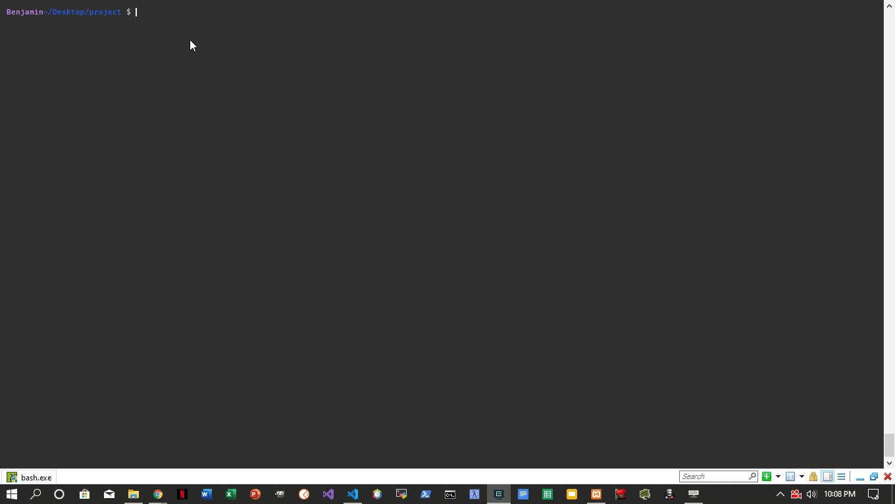
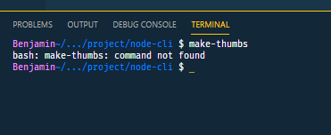
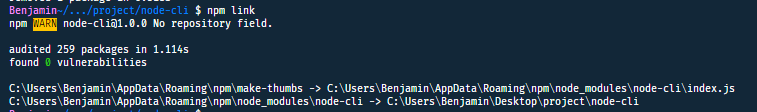
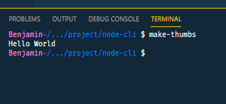
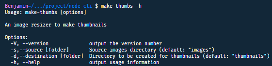

[Source Code](https://github.com/benjaminadk/node-cli-tutorial)

JavaScipt can do a lot more than just work in the browser. With the help of _Node_ it can be used to build powerful command line tools. I recently created my own CLI to speed up repetitive tasks at work. The project we build in this article be a small portion of that and will do a lot more than print "Hello World".

If you don't have _Node_ installed on your local machine download it [HERE](https://nodejs.org/en/).

## Option 1 - Clone Source Code

Download the zip or better yet clone the source code to your local machine.

```bash
git clone https://github.com/benjaminadk/node-cli-tutorial.git
```

## Option 2 - Build From Scratch

If you want to code along with me and build from scratch just continue reading.

The first thing needed is a folder to store your project code in.

```bash
mkdir node-cli
cd node-cli
```

Lets initialize this folder as an _NPM_ project and create a file to write some code in. _NPM_ stands for _Node Package Manager_, by the way. [Check out NPM](https://www.npmjs.com/).

```bash
npm init -y
touch index.js
```

If any of the instructions above were unfamiliar or didn't work you might want to do some googling now and learn more about _Node_, _NPM_ and the command line in general.



Now would be a good time to clue everyone in one what this application is actually going to do.

Drum roll please. 🥁

We are going to make thumbnail images. More specifically, we will be able to navigate to a directory full of images via the command line, invoke our command, and create a new directory full of thumbnails. Of course, tasks like this can be accomplished with Photoshop and other image manipulation software, but we are programmers and we want to make our own. In this use case we will be making 225x190 pixel thumbnails from 800x800 textile images and saving them as 40% quality JPEGs. To help make this super easy we will use a package called [Jimp](https://github.com/oliver-moran/jimp). While we are downloading stuff lets get [Commander](https://github.com/tj/commander.js) and [rimraf](https://github.com/isaacs/rimraf) as well. _Commander_ is a helpful framework for command line apps and _rimraf_ is a file system utility to help us delete a directory and its contents programmatically.

Make sure you are in the project directory aka the same level as `package.json` aka the root.

```bash
npm install jimp commander rimraf
```

To make sure everything is working correctly, add a little code to `index.js`.

<div class='filename'>index.js</div>

```javascript
console.log('Hello World')
```

And we're done! 😎. Just kidding. This is just to make sure _Node_ is working. I try to write tutorials that beginners can follow. From inside our `node-cli` directory we can now run the following.

```bash
node ./index.js
```

Quick tip. `index.js` is recognized as a sort of default filename in _Node_. This works as well.

```bash
node .
```

You should see `Hello World` printed in the terminal.

This is how _JavaScript_ files are executed by the _Node_ interpreter. However, the goal of this exercise is to make a command line tool. We want to be able to type a command anywhere on our computer and have our code execute.

First add the following line to the top of `index.js`. Understanding this line isn't important right now. It uses a _Shebang_ - _#!_ - and instructs the system to use _Node_ to interpret this file. This is required when building command line applications with _NPM_.

<div class='filename'>index.js</div>

```javascript
#!/usr/bin/env node // highlight-line

console.log('Hello World')
```

The `package.json` file also needs to be updated. The important lines are highlighted. This `bin` key is telling _NPM_ that when we type `make-thumbs` on the command line we want to run `index.js`. I named it `make-thumbs` just to avoid any conflicts with `node-cli`, but this can be named anything really. The corresponds to the text typed into the command prompt to execute our app. Common commands include `cd`, `ls`, `curl`, `mkdir`, and tons more. When these commands are entered there is actually code running somewhere behind the scenes.

<div class='filename'>package.json</div>

```javascript
{
  "name": "node-cli",
  "version": "1.0.0",
  "description": "Command line tutorial",
  "main": "index.js",
  "bin": {// highlight-line
    "make-thumbs": "./index.js" // highlight-line
  }, // highlight-line
  "scripts": {
    "test": "echo \"Error: no test specified\" && exit 1"
  },
  "keywords": [],
  "author": {
    "name": "benjaminadk",
    "email": "benjaminadk@gmail.com",
    "url": "https://github.com/benjaminadk"
  },
  "license": "ISC",
  "dependencies": {
    "commander": "4.1.0",
    "jimp": "0.9.3"
  }
}
```

Now type `make-thumbs` in the command line. It should throw and error something like what you see below.



There is one more step to wire the global command to work on our system. Make sure you are in the root of the project.

```bash
npm link
```

This should trigger the following output. _NPM_ is working magic behind the scenes.



Try typing `make-thumbs` in the command line one more time.



Tada! 😁

Note that this link can be undone via `npm unlink`. On a Windows machine you can check `"~\AppData\Roaming\npm` to see that _NPM_ has created a `.cmd` file corresponding to the command name. `~` refers to `C:\Users\your-user-name` aka the `HOME` directory. This information is not crucial but nice to know.

Now this project is setup and we can add some useful code.

<div class='filename'>index.js</div>

```javascript
#!/usr/bin/env node

const program = require('commander')

program
  .version('1.0.0')
  .name('make-thumbs')
  .description('An image resizer to make thumbnails')
  .option('-s,--source [folder]', 'Source images directory', 'images')
  .option(
    '-d,--destination [folder]',
    'Directory to be created for thumbnails',
    'thumbnails'
  )
  .parse(process.argv)
```

Commander is a great framework and helps to set up options and produces help menus automatically. Here I am assigning a version, name and description, as well as some options. Finally, we are parsing `process.argv`. These are the arguments provided to the command. With just this code we already have a working command line tool.

```bash
make-thumbs --help
```



The options allow the input of a directory of source images and a directory to save the new thumbnails. These are relative to the current working directory and not absolute paths. I have created aliases `-s`, normal options - `--source`, descriptions and defaults. Now the filesystem and image manipulation logic can be added.

I want to create a separate folder and file to hold some of this logic to keep things organized and modular.

```bash
mkdir lib
cd lib
touch index.js
```

I want to take advantage of _Async/Await_ code so I am using `promisify`. These utilities help to read directories, make directories, remove directories and check if directories exist. Consult the _Node_ documentation for more information on these. I have also including the _Jimp_ logic to create a thumbnail to our specs. Consult their documentation more information.

<div class='filename'>lib/index.js</div>

```javascript
const jimp = require('jimp')
const rimraf = require('rimraf')

const fs = require('fs')
const { promisify } = require('util')

const thumbnail = async (src, dest) => {
  const image = await jimp.read(src)
  await image.resize(225, 190, jimp.RESIZE_BICUBIC)
  image.quality(40)
  await image.writeAsync(dest)
}

const directoryExists = filepath => {
  return fs.existsSync(filepath)
}

const readdir = promisify(fs.readdir)
const mkdir = promisify(fs.mkdir)
const rm = promisify(rimraf)

module.exports = {
  thumbnail,
  directoryExists,
  readdir,
  mkdir,
  rm
}
```

Here is the finished code for `index.js` with our utilities imported.

<div class='filename'>index.js</div>

```javascript
#!/usr/bin/env node

const program = require('commander')
const path = require('path')

const { thumbnail, directoryExists, readdir, mkdir, rm } = require('./lib')

program
  .version('1.0.0')
  .name('make-thumbs')
  .description('An image resizer to make thumbnails')
  .option('-s,--source [folder]', 'Source images directory', 'images')
  .option(
    '-d,--destination [folder]',
    'Directory to be created for thumbnails',
    'thumbnails'
  )
  .parse(process.argv)

const main = async () => {
  try {
    // Use current working dir vs __dirname where this code lives
    const cwd = process.cwd()

    // Use user input or default options
    const { source, destination } = program
    const srcPath = path.join(cwd, source)
    const destPath = path.join(cwd, destination)

    // Remove destination directory is it exists
    if (directoryExists(destPath)) {
      await rm(destPath)
    }

    // Create destination directory
    await mkdir(destPath)

    // Read source directory
    const imagesAll = await readdir(srcPath)

    // Create thumbnails
    for (let image of imagesAll) {
      const src = path.join(srcPath, image)
      const dest = path.join(destPath, image)
      console.log(`Creating thumbnail at: ${dest}`)
      thumbnail(src, dest)
    }

    console.log('Thumbnails created successfully!')
  } catch (error) {
    console.log('Error creating thumbnails.')
  }
}

main()
```

All of our logic is placed inside the `main` function which is executed at the bottom of the code. Within `main` there is a `try/catch` block. This is helpful to control any error messages that may occur. With this structure the message inside the `catch` block is all the user will see if there is an error. This can be customized to any message desired, including part or all of the actual error thrown. In development you can simply log the error here to troubleshoot.

One important aspect is the use of `process.cwd()`. This command line application works based on the directory level the user is located in. This is used to create the paths to the source and destination folders. The destination folder is deleted and created again if it exists. Then the contents of the source directory are read into memory. Finally, these files are looped over and a thumbnail is created for each image and saved into the destination folder. I added some logs to give a sense of the program working. These can be removed or even replaced with some sort of progress logic. It is all up to you!

To make sure everything is working I have included a `test` directory in the source files. To test functionality do the following.

```bash
cd test
make-thumbs
```

Everything should be working! I made a quick video to demonstate the application in action.

<iframe width="560" height="315" src="https://www.youtube.com/embed/Mjzr1jwlaCQ" frameborder="0" allow="accelerometer; autoplay; encrypted-media; gyroscope; picture-in-picture" allowfullscreen></iframe>
