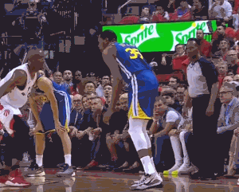

When you want to convey as message, but an image is too simplistic and a video is too complex, a _GIF_ can be the perfect middle ground. As a _JavaScript_ developer, I recently wondered:

1. Could I write a program to create a _GIF_?
2. Could _JavaScript_ even do this?

After a little research and a lot of trial and error, I found the answer to both question is `yes`. This article sums up what I found out.

<div class='center'>

</div>

---

## The GIF Format

A good starting point is to research some of the history and structure of a _GIF_. It turns out the _Graphics Interchange Format_ has was originally created by _CompuServe_ back in the 1980s and was one of the first image formats used on the web. While the _PNG_ format has pretty much replaced _GIF_ for single images, _GIF's_ ability to animate a series of images keeps the format relevant and supported today. In _GIFs_ as we know them today, each image is allowed a maximum palette size of 256 colors. This limitation is why _GIFs_ are more suited to illustrations rather than photography, even though they are used for both. _GIF_ images are also compressed using the _LZW_ algorithm, which provides lossless data compression. For more general information, [Wikipedia](https://en.wikipedia.org/wiki/GIF) is a great source, and for an in-depth breakdown of the entire specification, check out [What's In a GIF](http://giflib.sourceforge.net/whatsinagif/index.html).

## My Use Case

I have been playing around with [Electron](https://electronjs.org/) a lot lately and I decided to attempt a desktop application that could record the user's screen and then turn the captured images into a _GIF_. The _Electron_ environment combines the features of the browser, the the features of [Node](https://nodejs.org/en/), and _Electron's_ own APIs. This makes capturing the screen a frame at a time and then saving those images to disk possible. My project article [GifIt](https://benjaminbrooke.me/projects/gifit/) goes into more detail on that subject. At this point, my goal became to write my own library for _GIF_ encoding.

## Existing Libraries

The next step I took was to look into existing libraries on [NPM](https://www.npmjs.com/) and [Github](https://github.com/). There are a few options, and which one you use depends a lot of your use case and the available documentation. It looks like the original implementation in _JavaScript_ was [gif.js](https://github.com/jnordberg/gif.js). I poked around the files and was happy to find that the `LZWEncoder` and `NeuQuant` algorithms had already been ported. I used these as building blocks for my library.

## My Library

One thing I noticed about existing libraries was that _GIFs_ took a long time to process and the size of the output files seemed really large. [GIF Encoder 2](https://github.com/benjaminadk/gif-encoder-2) adds new features to help mitigate these downsides. The first thing I did was add an optional optimizer. I discoved that a lot of time was being spent reducing an image into its 256 color palette. This process involves looking at the color of every pixel in an image and was being done by the _NeuQuant_ algoritm. I added the ability to reuse the palette from the previous image if the current and previous image were similar. Checking this adds overhead, but not nearly as much overhead as calculating a new color palette. I also added a second algorithm called _Octree_ that uses a totally different method to calculate the color palette. This ended up resulting in smaller smaller file sizes.

## Using Gif Encoder 2

```bash
npm install gif-encoder-2
```

### Constructor

`GIFEncoder(width, height, algorithm, useOptimizer, totalFrames)`

|   Parameter    |  Type   |          Description           | Required |  Default   |
| :------------: | :-----: | :----------------------------: | :------: | :--------: |
|    `width`     | number  | the width of images in pixels  |   yes    |    n/a     |
|    `height`    | number  | the height of images in pixels |   yes    |    n/a     |
|  `algorithm`   | string  |     `neuquant` or `octree`     |    no    | `neuquant` |
| `useOptimizer` | boolean |   enables/disables optimizer   |    no    |   false    |
| `totalFrames`  | number  |     total number of images     |    no    |     0      |

```js
const encoder = new GIFEncoder(500, 500)
const encoder = new GIFEncoder(1200, 800, 'octree', false)
const encoder = new GIFEncoder(720, 480, 'neuquant', true, 20)
```

### Methods

|        Method        |    Parameter     |               Description               |
| :------------------: | :--------------: | :-------------------------------------: |
|       `start`        |       n/a        |           Starts the encoder            |
|      `addFrame`      | `Canvas Context` |         Adds a frame to the GIF         |
|      `setDelay`      |     `number`     | Number of milliseconds to display frame |
| `setFramesPerSecond` |     `number`     | Number of frames per second to display  |
|     `setQuality`     |  `number 1-30`   |            Neuquant quality             |
|    `setThreshold`    |  `number 0-100`  |     Optimizer threshold percentage      |
|     `setRepeat`      |  `number >= 0`   |        Number of loops GIF does         |
|       `finish`       |       n/a        |            Stops the encoder            |

### Basic Example

This example creates a simple _GIF_ and shows the basic way _Gif Encoder 2_ works.

1. Create an instance of `GIFEncoder`
2. Call any needed `set` methods
3. Start the encoder
4. Add frames as _Canvas_ `context`
5. Get the output data and do something with it

```javascript
const GIFEncoder = require('gif-encoder-2')
const { createCanvas } = require('canvas')
const { writeFile } = require('fs')
const path = require('path')

const size = 200
const half = size / 2

const canvas = createCanvas(size, size)
const ctx = canvas.getContext('2d')

function drawBackground() {
  ctx.fillStyle = '#ffffff'
  ctx.fillRect(0, 0, size, size)
}

const encoder = new GIFEncoder(size, size)
encoder.setDelay(500)
encoder.start()

drawBackground()
ctx.fillStyle = '#ff0000'
ctx.fillRect(0, 0, half, half)
encoder.addFrame(ctx)

drawBackground()
ctx.fillStyle = '#00ff00'
ctx.fillRect(half, 0, half, half)
encoder.addFrame(ctx)

drawBackground()
ctx.fillStyle = '#0000ff'
ctx.fillRect(half, half, half, half)
encoder.addFrame(ctx)

drawBackground()
ctx.fillStyle = '#ffff00'
ctx.fillRect(0, half, half, half)
encoder.addFrame(ctx)

encoder.finish()

const buffer = encoder.out.getData()

writeFile(path.join(__dirname, 'output', 'beginner.gif'), buffer, error => {
  // gif drawn or error
})
```

---

- beginner.gif


---

### Advanced Example

This example creates a reusable function that reads a directory of image files and turns them into a _GIF_. The encoder itself isn't as complicated as the surrounding code.

Note that `setDelay` can be called once (sets all frames to value) or once per frame (sets delay value for that frame).

Obviously, you can use any directory and filenames you want if you recreate the following example.

1. Read a directory of images (gets the path to each image)
2. Create an `Image` to find the dimensions
3. Create a write `stream` to an output `gif` file
4. Create an instance of the `GIFEncoder`
5. Pipe the encoder's read `stream` to the write `stream`
6. Call any needed `set` methods
7. Start the encoder
8. Draw each image to a _Canvas_
9. Add each `context` to encoder with `addFrame`
10. When _GIF_ is done processing `resolve1()` is called and function is done
11. Use this function to compare the output of both _NeuQuant_ and _Octree_ algorithms

```javascript
const GIFEncoder = require('gif-encoder-2')
const { createCanvas, Image } = require('canvas')
const { createWriteStream, readdir } = require('fs')
const { promisify } = require('util')
const path = require('path')

const readdirAsync = promisify(readdir)
const imagesFolder = path.join(__dirname, 'input')

async function createGif(algorithm) {
  return new Promise(async resolve1 => {
    const files = await readdirAsync(imagesFolder)

    const [width, height] = await new Promise(resolve2 => {
      const image = new Image()
      image.onload = () => resolve2([image.width, image.height])
      image.src = path.join(imagesFolder, files[0])
    })

    const dstPath = path.join(__dirname, 'output', `${algorithm}.gif`)

    const writeStream = createWriteStream(dstPath)

    writeStream.on('close', () => {
      resolve1()
    })

    const encoder = new GIFEncoder(width, height, algorithm)

    encoder.createReadStream().pipe(writeStream)
    encoder.start()
    encoder.setDelay(200)

    const canvas = createCanvas(width, height)
    const ctx = canvas.getContext('2d')

    for (const file of files) {
      await new Promise(resolve3 => {
        const image = new Image()
        image.onload = () => {
          ctx.drawImage(image, 0, 0)
          encoder.addFrame(ctx)
          resolve3()
        }
        image.src = path.join(imagesFolder, file)
      })
    }
  })
}
```

```javascript
createGif('neuquant')
createGif('octree')
```

- _NeuQuant_


- _Octree_



---

## Alternative Encoding Method

While _Gif Encoder 2_ is reliable and can encode _GIFs_ faster than other existing libraries, I did find one alternative that works better but requires the [FFmpeg](https://ffmpeg.org/) stream processing library to be installed on the host machine. _FFmpeg_ is a command line tool, but can be executed by _Node_ using the `child_process` API. When I was creating _GifIt_ I added the ability to adjust the duration of each frame in the _GIF_. Imagine a user wants to display a title page for 5 seconds before running through the rest of the frames or wants to cut the duration of certain frames by half. In order to accomadate these variable durations _FFmpeg_ requires a text file describing the path and duration of each image. The duration is in seconds and the paths are relative.

- example from [FFmpeg Docs](https://trac.ffmpeg.org/wiki/Slideshow)

```txt
file '/path/to/dog.png'
duration 5
file '/path/to/cat.png'
duration 1
file '/path/to/rat.png'
duration 3
file '/path/to/tapeworm.png'
duration 2
file '/path/to/tapeworm.png'
```

This is a simplifed version of the function I used in _GifIt_.

- `images` is an object that contains the absolute path and duration of the frame
- `dstPath` is the destination to save the output _GIF_ file
- `cwd` is the absolute path of the current working directory (image files must be here as well)
- `ffmpegPath` is the absolute path to the _FFmpeg_ executable on the host machine
- the path to the last image is added twice to ensure thhe _GIF_ loops correctly

```javascript
import { execFile } from 'child_process'
import fs from 'fs'
import path from 'path'
import { promisify } from 'util'

const writeFile = promisify(fs.writeFile)

export const createGif = async (images, dstPath, cwd, ffmpegPath) => {
  return new Promise(resolve => {
    let str = ''
    images.forEach((image, i) => {
      str += `file ${path.basename(image.path)}\n`
      str += `duration ${image.duration}\n`
    })
    str += `file ${path.basename(images[images.length - 1].path)}`
    const txtPath = path.join(cwd, 'template.txt')
    writeFile(txtPath, str).then(() => {
      execFile(
        ffmpegPath,
        [
          '-f',
          'concat',
          '-i',
          'template.txt',
          '-lavfi',
          'palettegen=stats_mode=diff[pal],[0:v][pal]paletteuse=new=1:diff_mode=rectangle',
          dstPath
        ],
        { cwd },
        (error, stdout, stderr) => {
          if (error) {
            throw error
          } else {
            resolve()
          }
        }
      )
    })
  })
}
```

Best of luck creating your _GIFs_!!! Hit me up if you have any questions.
