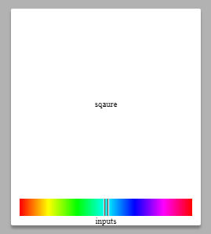
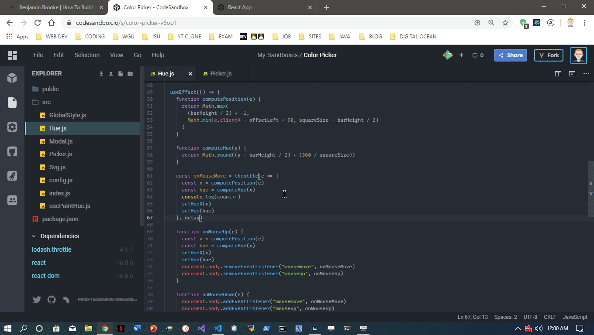
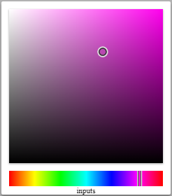

Building a color picker was one of the first projects I tried my hand at once I knew how to string together a couple lines of _JavaScript_. They were total abombinations if my memory serves me correctly. Recently, I needed a simple color picker for my lastest project [Palette Pal](https://github.com/benjaminadk/palette-pal). This article will cover the step by step process. The target audience for the article probably has some experience with _React_, but by no means does it require expert ability. I will do by best to keep a slow pace and explain the thinking behind component composition and how the pieces fit.

<iframe src="https://codesandbox.io/embed/color-picker-v6oo1?fontsize=14" title="Color Picker" allow="geolocation; microphone; camera; midi; vr; accelerometer; gyroscope; payment; ambient-light-sensor; encrypted-media" style="width:100%; height:500px; border:0; border-radius: 4px; overflow:hidden;" sandbox="allow-modals allow-forms allow-popups allow-scripts allow-same-origin"></iframe>

## Getting Started

Start by creating a new [Code Sandbox](https://codesandbox.io/) with the _React_ template. It is a free service and has a realistic file structure with the ability add dependencies in a super easy fashion. This tutorial will use [Styled Components](https://www.styled-components.com) so install it and delete the `.css` file and its `import` statement. If you are not familiar with _Styled Components_ have no fear, 90% of it is just _CSS_. To keep things simple, all files will be in the `src` directory. Here is some basic starter code.

- `index.js` is the root of our application

<div class='filename'>index.js</div>

```jsx
import React from 'react'
import ReactDOM from 'react-dom'
import styled from 'styled-components'
import Picker from './Picker'
import { GlobalStyle } from './GlobalStyle'

const AppWrapper = styled.div`
  height: 100vh;
  display: grid;
  align-items: center;
  justify-items: center;
`

function App() {
  return (
    <>
      <GlobalStyle />
      <AppWrapper>
        <Picker />
      </AppWrapper>
    </>
  )
}

const rootElement = document.getElementById('root')
ReactDOM.render(<App />, rootElement)
```

- `GlobalStyle.js` holds our project wide style

<div class='filename'>GlobalStyle.js</div>

```jsx
import React from 'react'
import { createGlobalStyle } from 'styled-components'

export const GlobalStyle = createGlobalStyle`
html {
  box-sizing: border-box;
  font-size: 10px;
}
body {
  font-family: monospace;
  font-weight: bold;
  margin: 0;
}
*, *:before, *:after {
  box-sizing: inherit;
}
`
```

- `Picker.js` is where the magic will happen

<div class='filename'>Picker.js</div>

```jsx
import React, { useState, useRef, useEffect } from 'react'
import styled from 'styled-components'

export const PickerWrapper = styled.div`
  .swatch {
    width: 100px;
    height: 50px;
    background: ${p => p.color};
  }
`

const Picker = () => {
  const [color, setColor] = useState('#000000')

  return (
    <>
      <PickerWrapper color={color}>
        <div className='swatch' />
      </PickerWrapper>
    </>
  )
}

export default Picker
```

This boilerplate should result in a black rectangle in the middle of the screen. The goal to have the color picker appear when this rectangle is clicked and for its background color to be dynamically set based on user input. The first thing needed is some sort of container to hold the color picker that acts like a _Modal_, opening when the rectangle is clicked and having the ability to close via a button or clicking the screen outside the _Picker_.

---

## Modal

<div class='filename'>Modal.js</div>

```jsx
import React from 'react'
import styled, { keyframes } from 'styled-components'

const zoom = keyframes`
  from {
    transform: scale(0) translate(-50%, -50%);
  }
  to {
    transform: scale(1) translate(-50%, -50%);
  }
`

export const Backdrop = styled.div`
  position: fixed;
  z-index: 1;
  top: 0;
  bottom: 0;
  left: 0;
  right: 0;
  display: ${p => (p.show ? 'block' : 'none')};
  background: rgba(0, 0, 0, 0.3);
`

export const ModalWrapper = styled.div`
  position: fixed;
  top: 50%;
  left: 50%;
  z-index: 2;
  transform: translate(-50%, -50%);
  transform-origin: left top;
  max-width: 100%;
  height: auto;
  display: ${p => (p.show ? 'block' : 'none')};
  animation: ${zoom} 0.2s;
`
const Modal = ({ modal, show, onClose, children }) => {
  return (
    <>
      <Backdrop show={show} onClick={onClose} />
      <ModalWrapper ref={modal} show={show}>
        {children}
      </ModalWrapper>
    </>
  )
}

export default Modal
```

The Modal component works by layering a backdrop and an inner container. The backdrop is fixed behind the modal using the `z-index` property. This allows the backdrop to listen for clicks and close the entire component while the foreground can be clicked without triggering a close. The funny looking brackets `<></>` are shorthand for _React.Fragment_ and allow sibling elements to be returned by a component. The `show` prop is a `Boolean` passed down from _Picker_ to control the `display` style. When `show` is `false` the style is set to `display: none`. _Styled Components_ also comes with a `keyframes` helper function which is used with `transform: scale()` to give a zoom effect when the _Picker_ appears. The `children` prop is available on all components in _React_ and allows the _Modal_ to be a reusable wrapper component. Finally, the `modal` prop is a `ref` that will be used later in positioning calculations.

As a side note, this basic _Modal_ can be used for anything - signups, forms, images, videos, etc. The trick is the 50% positioning and transformation that automatically centers the contents. Tweak the animation styles, transform origin and width to suite particular use cases. Also, set the value of `show` to true to speed up development. This will remove the annoying step of clicking the swatch on every update.

- Add Modal to Picker

```jsx
const Picker = () => {
  const [show, setShow] = useState(false)
  const [color, setColor] = useState("#000000")

  const modal = useRef(null)

  return (
    <>
      <PickerWrapper color={color}>
        <div className="swatch" onClick={() => setShow(true)} />
        <Modal modal={modal} show={show} onClose={() => setShow(false)}>
          <div>😎</div>
        </Modal>
      </PickerWrapper>
    </>
  )
}v
```

Make sure to `import` the Modal component into Picker. Create `show` and `setShow` with `useState` and `modal` with `useRef`. Now clicking the rectangle will open the modal and the 😎 should appear. `<div>😎</div>` becomes the `children` props referenced in the last step.

---

## Config

Before moving on create a `config.js` file to hold a few constants.

<div class='filename'>config.js</div>

```js
export default {
  squareSize: 200,
  barSize: 20,
  crossSize: 15,
  inputSize: 40,
  delay: 150
}
```

The `squareSize` will be both the width and height of the _Saturation_ / _Lightness_ square. `barSize` is the height of the _Hue_ component as well as both the width and height of the _Handle_ (user drags this to set hue). The `crossSize` is the width and height of the draggable icon that will be used on the _Square_. `inputSize` is the height of a row of inputs. The `delay` value will be used together with `lodash.throttle`, which should be added as a dependency. This component will implement various mouse event listeners that can be triggered constantly, potentially slowing the application down. The callback functions will be throttled so they can only execute once every `delay` seconds. Understanding everything now is not important as the pieces will come together as this article goes.

---

## Hue

This color picker can incorporate various color formats but for now [HSL](https://en.wikipedia.org/wiki/HSL_and_HSV) or _Hue, Saturation, Lightness_ works the best for user input. The _Hue_ component is a rectangular bar displaying the full range of hues from 0 to 360.



The _Hue_ bar itself is actually an _HTML Canvas_ element. When the _Picker_ loads, a custom _React_ hook is used to draw the 360 degrees of color. A `ref` to the underlying _DOM_ node is passed to the hook so that `Canvas.getContext()` can be called. The hook uses `ctx.createLinearGradient()` and a `for` loop to add the necessary color stops to the gradient. Using the _HSL_ color format makes this process easy. A custom hook is not necessary but it does separate concerns.

<div class='filename'>usePaintHue</div>

```jsx
import React, { useEffect } from 'react'
import config from './config'

const { squareSize, barSize } = config

const usePaintHue = canvas => {
  useEffect(() => {
    const ctx = canvas.current.getContext('2d')
    ctx.rect(0, 0, squareSize, barSize)

    const gradient = ctx.createLinearGradient(0, 0, squareSize, 0)
    for (let i = 0; i <= 360; i += 30) {
      gradient.addColorStop(i / 360, `hsl(${i}, 100%, 50%)`)
    }
    ctx.fillStyle = gradient
    ctx.fill()
  }, [canvas])
}

export default usePaintHue
```

The _Picker_ will keep track of a few more pieces of state effected by _Hue_. The `hue` value will be a number between 0 and 360, `hueX` is the position the handle and `offsetLeft/offsetTop` will come from the `modal` ref and help in calculations. Notice the `useEffect` hook is calculating the offsets when the _Modal_ is opened. It also attaches an event listener for the `resize` event. These offsets are the distance between the _Modal_ and its nearest parent so the values change when the window size changes. This change trickles down into the position calculations so it needs be accounted for. Finally, yet another hook is added to watch for changes in the `hue` value. When the `hue` changes the `color` state can be updated using a template string.

<div class='filename'>Picker.js</div>

```jsx
import React, { useState, useRef, useEffect } from 'react'
import styled from 'styled-components'
import Modal from './Modal'
import Hue from './Hue'
import config from './config'

const { squareSize, barSize } = config

export const PickerWrapper = styled.div`
  user-select: none;
  .swatch {
    width: 100px;
    height: 50px;
    background: ${p => p.color};
  }
`

export const PickerOuter = styled.div`
  width: ${squareSize + 20}px;
  display: grid;
  border-radius: 2px;
  background: #ffffff;
  box-shadow: 0 3px 3px rgba(0, 0, 0, 0.3);
`

export const PickerInner = styled.div`
  display: grid;
  grid-template-rows: ${squareSize + 20}px 20px 1fr;
  align-items: center;
  justify-items: center;
`

const Picker = () => {
  const [show, setShow] = useState(true)
  const [hue, setHue] = useState(180)
  const [hueX, setHueX] = useState(() => squareSize / 2 - barSize / 2)
  const [offsetTop, setOffsetTop] = useState(0)
  const [offsetLeft, setOffsetLeft] = useState(0)
  const [color, setColor] = useState(`hsla(180, 100%, 50%, 1)`)

  const modal = useRef(null)

  useEffect(() => {
    function setOffsets() {
      setOffsetTop(modal.current.offsetTop)
      setOffsetLeft(modal.current.offsetLeft)
    }
    if (show) {
      setOffsets()
      window.addEventListener('resize', setOffsets)
    } else {
      window.removeEventListener('resize', setOffsets)
    }

    return () => {
      window.removeEventListener('resize', setOffsets)
    }
  }, [show])

  useEffect(() => {
    setColor(`hsla(${hue}, 100%, 50%, 1)`)
  }, [hue])

  return (
    <>
      <PickerWrapper color={color}>
        <div className='swatch' onClick={() => setShow(true)} />
        <Modal modal={modal} show={show} onClose={() => setShow(false)}>
          <PickerOuter>
            <PickerInner>
              <div>sqaure</div>
              <Hue hueX={hueX} offsetLeft={offsetLeft} setHueX={setHueX} setHue={setHue} />
              <div>inputs</div>
            </PickerInner>
          </PickerOuter>
        </Modal>
      </PickerWrapper>
    </>
  )
}

export default Picker
```

---

There is a decent amout going on in the _Hue_ component. There is a wrapper that holds the _Canvas_ and _Handle_ components. A ref is used to paint the _Canvas_ with the _usePaintHue_ hook. The _Handle_ uses absolute positioning, specifically the `left` property to determine its location. The component applies a cycle of event listeners. Everything is initiated by the `mousedown` event. This triggers the assignment of two more event listeners, one for `mouseup` and the other for `mousemove`. The idea is to only listen for the events needed at the appropriate times. Put another way, when the the mouse is pressed and moving the user is moving the _Handle_.

The `mousemove` event listener is attached to the `document.body` element because when dragging a handle such as this it is very unlikely the user will stay within the bounds of the _Picker_. The event handler is throttled with `lodash.throttle` so it can only fire once every `delay` seconds. Try changing the `delay` and logging `x` (the result of the `computePosition` function). As you will see, throttling makes a big difference. When the _Square_ component is built this will be even more important due to the increase in processor load from canvas repaints.

<div class='center'>

</div>

If some of the calculations seem confusing its because they are. The `barSize` is used because it is also the same value as the width and height of _Handle_. In this case the width of the _Handle_ is part of calculating the `left` position. Lets walk through the steps that happen when the `mousemove` event handler is fired.

1. The event object is passed to `computePosition`
2. `Math.max` is used ensuring the smallest value returned is negative half the width of the _Handle_ or `(barSize / -2)`. This is the `left` value when the `hue` is 0. To make the UI look proper when `hue` is 0, half the _Handle_ should be hanging off the left side of _HueWrapper_. This is needed because the function is using `e.clientX` which is the x cursor position on the page. There are alternatives - such as applying the `mousemove` listeners to other elements, but I found this setup to offer the best user experience.
3. The value produced from `Math.min` makes sure no value can be returned greater than the _Handle_ hanging halfway off the right end of the _HueWrapper_. The value of `squareSize - barSize / 2` represents this maximum.
4. When the _Handle_ is located anywhere between the extremes of the _HueWrapper_ the expression `e.clientX - offsetLeft + squareSize / 2 - barSize / 2` is used to calculate `left`.
5. The `hueX` value is used to interpolate the `hue`. The expression `x + barSize / 2` gets the value of the center of the _Handle_. Remember `x` is the `left` position which is based on the left edge of the _Handle_. A simple ratio between 360 and the width of the _HueWrapper_ is multiplied by `x` to calculate the `hue`.

<div class='filename'>Hue.js</div>

```jsx
import React, { useRef, useEffect } from 'react'
import styled from 'styled-components'
import throttle from 'lodash.throttle'
import Svg from './Svg'
import usePaintHue from './usePaintHue'
import config from './config'

const { squareSize, barSize, delay } = config

export const HueWrapper = styled.div`
  position: relative;
  width: ${squareSize + 'px'};
  height: ${barSize + 'px'};
  cursor: ew-resize;
`

export const Canvas = styled.canvas.attrs(p => ({
  width: squareSize,
  height: barSize
}))``

export const Handle = styled.div.attrs(p => ({
  style: {
    left: p.left + 'px',
    transition: p.animate ? 'left .25s ease-out' : '0s'
  }
}))`
  position: absolute;
  top: 0px;
  display: flex;
  align-items: center;
  justify-content: space-between;
  width: ${barSize}px;
  height: ${barSize}px;
  pointer-events: none;
  svg {
    width: 100%;
    height: 100%;
  }
`

const Hue = ({ hueX, offsetLeft, animate, setHueX, setHue }) => {
  const bar = useRef(null)
  const canvas = useRef(null)

  usePaintHue(canvas)

  useEffect(() => {
    function computePosition(e) {
      return Math.max(
        barSize / -2,
        Math.min(e.clientX - offsetLeft + squareSize / 2 - barSize / 2, squareSize - barSize / 2)
      )
    }

    function computeHue(x) {
      return Math.round((x + barSize / 2) * (360 / squareSize))
    }

    const onMouseMove = throttle(e => {
      const x = computePosition(e)
      const hue = computeHue(x)

      setHueX(x)
      setHue(hue)
    }, delay)

    function onMouseUp(e) {
      const x = computePosition(e)
      const hue = computeHue(x)
      setHueX(x)
      setHue(hue)
      document.body.removeEventListener('mousemove', onMouseMove)
      document.body.removeEventListener('mouseup', onMouseUp)
    }

    function onMouseDown(e) {
      document.body.addEventListener('mousemove', onMouseMove)
      document.body.addEventListener('mouseup', onMouseUp)
    }

    const barRef = bar.current
    barRef.addEventListener('mousedown', onMouseDown)

    return () => {
      barRef.removeEventListener('mousedown', onMouseDown)
      document.body.removeEventListener('mousemove', onMouseMove)
      document.body.removeEventListener('mouseup', onMouseUp)
    }
  }, [offsetLeft, setHue, setHueX])

  return (
    <HueWrapper ref={bar}>
      <Handle left={hueX} animate={animate}>
        <Svg name='handle' />
      </Handle>
      <Canvas ref={canvas} />
    </HueWrapper>
  )
}

export default Hue
```

---

## Svg

The _Hue_ component has a handle that is actually an _Svg_ I made using [Boxy Svg](https://boxy-svg.com/). Check out [Svg Icons With No Artistic Ability](http://benjaminadk.netlify.com/posts/svg-icons-with-no-artistic-ability/) for more information on my _Svg_ work flow. For now this project only needs a few _Svg_ icons. Just import the _Svg_ component and pass a `name` prop that will match a string in the `switch` statement.

<div class='filename'>Svg.js</div>

```jsx
import React from 'react'

const Svg = ({ name, ...rest }) => {
  const getPath = p => {
    switch (p) {
      case 'check':
        return (
          <>
            <path d='M2.2326 30.1008l3.7139-5.9333L23.072 34.8882l19.2522-30.41 5.914 3.744-23.001 36.3315-5.914-3.744.0037-.0067z' />
          </>
        )
      case 'cross':
        return (
          <>
            <path
              d='M34.3656 3.0593000000000004A24.084 24.084 0 1 0 15.166 47.2354 24.084 24.084 0 1 0 34.3656 3.0593zM32.0123 8.474a18.18 18.18 0 0 1-14.493 33.3467A18.18 18.18 0 0 1 32.0123 8.474z'
              fill='#dfdfdf'
            />
            <path
              d='M36.7852 11.4797A18.168 18.168 0 1 0 12.8026 38.777a18.168 18.168 0 1 0 23.9826-27.2973zM33.6263 15.0752a13.382 13.382 0 0 1-17.6649 20.1063 13.382 13.382 0 0 1 17.6649-20.1063z'
              fill='#363636'
            />
          </>
        )
      case 'handle':
        return (
          <>
            <path d='M34.736998 0v49.921h-5.578V0zm-16.737 49.921V0h5.578v49.921z' fill='#dfdfdf' />
            <path fill='#363636' d='M31.371873.078V50h-2.316V.078zM23.470873 0v49.922h-2.316V0z' />
          </>
        )

      default:
        throw new Error('must provide a name prop to Svg')
    }
  }

  return (
    <svg viewBox='0 0 50 50' xmlns='http://www.w3.org/2000/svg' {...rest}>
      {getPath(name)}
    </svg>
  )
}

export default Svg
```

---

## Square

If the _Hue_ was confusing, the _Square_ will be worse! The _Square_ is be used to find both the _Saturation_ and the _Lightness_ of the color. Instead of working in a single dimension, the _Square_ exists in 2. The _Square_ will change color based on the current `hue` and the user will be able to drag a crosshair to select the color they want.



Once again a custom hook is used to fill the _Square_. Instead of only firing on page load, like the _Hue_ paint hook, this hook will fire every time the `hue` changes. This is why throttling is important. Repainting the _Square_ 100 times a second is not necessary and will slow down the app.

The paint process begins with simply filling the canvas with the current `hue`. The next step adds a white to transparent linear gradient from left to right. The last step adds a transparent to black linear gradient from top to bottom. The color underneath the cursor ends up being the color selected.

<div class='filename'>usePaintSquare.js</div>

```jsx
import React, { useEffect } from 'react'
import config from './config'

const { squareSize } = config

const usePaintSquare = (canvas, hue) => {
  useEffect(() => {
    const ctx = canvas.current.getContext('2d')
    ctx.fillStyle = `hsl(${hue}, 100%, 50%)`
    ctx.fillRect(0, 0, squareSize, squareSize)
    const gradientWhite = ctx.createLinearGradient(0, 0, squareSize, 0)
    gradientWhite.addColorStop(0, `rgba(255, 255, 255, 1)`)
    gradientWhite.addColorStop(1, `rgba(255, 255, 255, 0)`)
    ctx.fillStyle = gradientWhite
    ctx.fillRect(0, 0, squareSize, squareSize)
    const gradientBlack = ctx.createLinearGradient(0, 0, 0, squareSize)
    gradientBlack.addColorStop(0, `rgba(0, 0, 0, 0)`)
    gradientBlack.addColorStop(1, `rgba(0, 0, 0, 1)`)
    ctx.fillStyle = gradientBlack
    ctx.fillRect(0, 0, squareSize, squareSize)
  }, [canvas, hue])
}

export default usePaintSquare
```

Now we need a way to convert the cursor position in the _Square_ to a _Saturation_ and _Lightness_ value. The cool part about _Canvas_ is that we can use the `imageData` to get the color of any pixel. The not so cool part is that this data is in _RGB_ format and we are using _HSL_. This means before we can go any further we need a conversion function. Understanding this function is not important but knowing its signature is. The `convertRGBtoHSL` function takes an array of integers representing the red, green and blue values of a color and will return an array of integers representing the hue, saturation and lightness of a color. Simple 🤓!

<div class='filename'>utils.js</div>

```jsx
export const convertRGBtoHSL = rgb => {
  const r = rgb[0] / 255
  const g = rgb[1] / 255
  const b = rgb[2] / 255
  const min = Math.min(r, g, b)
  const max = Math.max(r, g, b)
  const delta = max - min
  let h
  let s

  if (max === min) {
    h = 0
  } else if (r === max) {
    h = (g - b) / delta
  } else if (g === max) {
    h = 2 + (b - r) / delta
  } else if (b === max) {
    h = 4 + (r - g) / delta
  }

  h = Math.min(h * 60, 360)

  if (h < 0) {
    h += 360
  }

  const l = (min + max) / 2

  if (max === min) {
    s = 0
  } else if (l <= 0.5) {
    s = delta / (max + min)
  } else {
    s = delta / (2 - max - min)
  }

  return [Math.round(h), Math.round(s * 100), Math.round(l * 100)]
}
```

With the groudwork laid down the _Square_ component can be implemented. _Square_ works in a similar way to _Hue_ but computes position for both the `left` and `top` values of its handle, which is called _Cross_ in this case just to keep naming conventions less confusing. The extra step takes place after the position is calculated. The `x` and `y` values are the position of _Cross_ which is stored as `[x, y]` in the `sqaureXY` state variable. `x1` and `y1` are the coordinates of the pixel in the center of the _Cross_ and are used with `ctx.getImageData` to get the _RGB_ value of that pixel. The _RGB_ value is fed through the conversion function and the _HSL_ value is returned. The hue is already known and `s` and `l` are combined into `square` state as `[s, l]`.

<div class='filename'>Square.js</div>

```jsx
import React, { useRef, useEffect } from 'react'
import styled from 'styled-components'
import throttle from 'lodash.throttle'
import { convertRGBtoHSL } from './utils'
import Svg from './Svg'
import usePaintSquare from './usePaintSquare'
import config from './config'

const { squareSize, crossSize, delay } = config

export const SquareWrapper = styled.div`
  position: relative;
  width: ${squareSize + 'px'};
  height: ${squareSize + 'px'};
  cursor: crosshair;
  box-shadow: 0 1px 2px rgba(0, 0, 0, 0.3);
`

export const Canvas = styled.canvas.attrs(p => ({
  width: squareSize,
  height: squareSize
}))``

export const Cross = styled.div.attrs(p => ({
  style: {
    top: p.top + 'px',
    left: p.left + 'px',
    width: crossSize + 'px',
    height: crossSize + 'px',
    transition: p.animate ? 'top .25s ease-out, left .25s ease-out' : '0s'
  }
}))`
  position: absolute;
  display: grid;
  justify-items: center;
  align-items: center;
  svg {
    width: 100%;
    height: 100%;
  }
`

const Square = ({ hue, squareXY, setSquare, offsetTop, offsetLeft, animate, setSquareXY }) => {
  const square = useRef(null)
  const canvas = useRef(null)

  usePaintSquare(canvas, hue)

  useEffect(() => {
    const canvasRef = canvas.current
    const ctx = canvasRef.getContext('2d')

    function computePosition(e) {
      const x = Math.max(
        crossSize / -2,
        Math.min(
          e.clientX - offsetLeft + squareSize / 2 - crossSize / 2,
          squareSize - crossSize / 2
        )
      )
      const y = Math.max(
        crossSize / -2,
        Math.min(e.clientY - offsetTop + squareSize / 2 + crossSize / 2, squareSize - crossSize / 2)
      )

      return [x, y]
    }

    function changeColor(e) {
      const [x, y] = computePosition(e)
      const x1 = Math.min(x + crossSize / 2, squareSize - 1)
      const y1 = Math.min(y + crossSize / 2, squareSize - 1)
      const [r, g, b] = ctx.getImageData(x1, y1, 1, 1).data
      const [h, s, l] = convertRGBtoHSL([r, g, b])
      setSquare([s, l])
      setSquareXY([x, y])
    }

    const onMouseMove = throttle(e => {
      changeColor(e)
    }, delay)

    function onMouseUp(e) {
      changeColor(e)
      document.body.removeEventListener('mousemove', onMouseMove)
      document.body.removeEventListener('mouseup', onMouseUp)
    }

    function onMouseDown(e) {
      document.body.addEventListener('mousemove', onMouseMove)
      document.body.addEventListener('mouseup', onMouseUp)
    }

    canvasRef.addEventListener('mousedown', onMouseDown)

    return () => {
      canvasRef.removeEventListener('mousedown', onMouseDown)
    }
  }, [offsetTop, offsetLeft, setSquare, setSquareXY])

  return (
    <SquareWrapper ref={square}>
      <Cross top={squareXY[1]} left={squareXY[0]} animate={animate}>
        <Svg name='cross' />
      </Cross>
      <Canvas ref={canvas} />
    </SquareWrapper>
  )
}

export default Square
```

---

With the values from _Square_ in hand the _Picker_ component can output a full _HSL_ color. I tweaked some to the intial state so that the _Picker_ starts off with `hsla(180, 100%, 50%, 1)`. The `useEffect` hook that updates `color` now listens for changes in the value of `square`.

<div class='filename'>Picker.js</div>

```jsx
import React, { useState, useRef, useEffect } from 'react'
import styled from 'styled-components'
import Modal from './Modal'
import Hue from './Hue'
import Square from './Square'
import config from './config'

const { squareSize, barSize, crossSize } = config

export const PickerWrapper = styled.div`
  user-select: none;
  .swatch {
    width: 100px;
    height: 50px;
    background: ${p => p.color};
  }
`

export const PickerOuter = styled.div`
  width: ${squareSize + 20}px;
  display: grid;
  border-radius: 2px;
  background: #ffffff;
`

export const PickerInner = styled.div`
  display: grid;
  grid-template-rows: ${squareSize + 20}px 20px 1fr;
  align-items: center;
  justify-items: center;
`

const Picker = () => {
  const [show, setShow] = useState(true)
  const [hue, setHue] = useState(180)
  const [hueX, setHueX] = useState(() => squareSize / 2 - barSize / 2)
  const [square, setSquare] = useState([100, 50])
  const [squareXY, setSquareXY] = useState(() => [squareSize - crossSize / 2, crossSize / -2])
  const [offsetTop, setOffsetTop] = useState(0)
  const [offsetLeft, setOffsetLeft] = useState(0)
  const [color, setColor] = useState(`hsla(180, 100%, 50%, 1)`)

  const modal = useRef(null)

  useEffect(() => {
    function setOffsets() {
      setOffsetTop(modal.current.offsetTop)
      setOffsetLeft(modal.current.offsetLeft)
    }
    if (show) {
      setOffsets()
      window.addEventListener('resize', setOffsets)
    } else {
      window.removeEventListener('resize', setOffsets)
    }

    return () => {
      window.removeEventListener('resize', setOffsets)
    }
  }, [show])

  useEffect(() => {
    setColor(`hsla(${hue}, ${square[0]}%, ${square[1]}%, 1)`)
  }, [hue, square])

  return (
    <>
      <PickerWrapper color={color}>
        <div className='swatch' onClick={() => setShow(true)} />
        <Modal modal={modal} show={show} onClose={() => setShow(false)}>
          <PickerOuter>
            <PickerInner>
              <Square
                hue={hue}
                squareXY={squareXY}
                offsetTop={offsetTop}
                offsetLeft={offsetLeft}
                setSquare={setSquare}
                setSquareXY={setSquareXY}
              />
              <Hue hueX={hueX} offsetLeft={offsetLeft} setHueX={setHueX} setHue={setHue} />
              <div>inputs</div>
            </PickerInner>
          </PickerOuter>
        </Modal>
      </PickerWrapper>
    </>
  )
}

export default Picker
```

---

## Inputs

A wide variety of inputs can be added to this color picker to take in user data. For this implementation we will have single inputs for _Hue_, _Saturation_ and _Lightness_. Even though the input type is _Number_ we will use text inputs. I prefer not having the default arrows. The _Input_ component takes in a `value` as well as `min`, `max` and `defaultValue`. When user input comes in it is checked to make sure it is a digit. If the value is outside of the `min`/`max` bounds it is automatically returned to the `defaultValue`. An `onBlur` event handler serves a similar purpose if the input is left empty.

<div class='filename'>Input.js</div>

```jsx
import React, { useRef } from 'react'
import styled from 'styled-components'

export const InputWrapper = styled.div`
  display: flex;
  align-items: center;
  user-select: none;
  label {
    font-size: 11px;
    margin-right: 5px;
  }
  input {
    width: 40px;
    text-align: center;
    border: 1px solid #ddd;
    outline: 0;
    font-family: monospace;
    font-size: 10px;
    padding: 4px 4px;
    user-select: none;
    &:focus {
      background: #fafafa;
    }
    &::selection {
      background: #ddd;
    }
  }
`

const Input = ({ label, value, max, min, defaultValue, setValue }) => {
  const input = useRef(null)

  function onBlur(e) {
    if (e.target.value === '') {
      setValue(defaultValue)
    } else if (e.target.value < min) {
      setValue(min)
    }
  }

  function onChange(e) {
    const isDigit = /^\d\*\$/
    var newValue
    if (isDigit.test(e.target.value)) {
      if (Number(e.target.value) > max) {
        newValue = max
      } else {
        newValue = Number(e.target.value)
      }
    } else {
      newValue = defaultValue
    }
    setValue(newValue)
  }

  return (
    <InputWrapper>
      <label>{label}</label>
      <input ref={input} value={value} onChange={onChange} onBlur={onBlur} autoFocus={false} />
    </InputWrapper>
  )
}

export default Input
```

New functions are needed to set the positions of the _Handle_ and _Cross_. You may have noticed some style logic based around the `animate` prop in some of the components. Essentially, the _Handle_ and _Cross_ will animate to their new positions when the _Inputs_ are used. When the user is dragging `animate` will be false. The `animate` prop and `setAnimate` must be passed down to _Hue_ and _Square_. Simply add `setAnimate(false)` to the `mousedown` event handler. A wrapper is also needed around the _Inputs_.

<div class='filename'>Picker.js</div>

```jsx
import React, { useState, useRef, useEffect } from 'react'
import styled from 'styled-components'
import Modal from './Modal'
import Hue from './Hue'
import Square from './Square'
import Input from './Input'
import config from './config'

const { squareSize, barSize, crossSize, inputSize } = config

export const PickerWrapper = styled.div`
  user-select: none;
  .swatch {
    width: 100px;
    height: 50px;
    background: ${p => p.color};
  }
`

export const PickerOuter = styled.div`
  width: ${squareSize + 20}px;
  display: grid;
  border-radius: 2px;
  background: #ffffff;
  box-shadow: 0 3px 3px rgba(0, 0, 0, 0.3);
`

export const PickerInner = styled.div`
  display: grid;
  grid-template-rows: ${squareSize + 20}px ${barSize}px ${inputSize}px;
  align-items: center;
  justify-items: center;
`

export const Inputs = styled.div`
  width: 100%;
  display: grid;
  grid-template-columns: repeat(3, 1fr);
  align-items: center;
  justify-items: center;
`

function computeHueX(h) {
  return Math.round((squareSize / 360) * h - barSize / 2)
}

function computeSquareXY(s, l) {
  const t = (s * (l < 50 ? l : 100 - l)) / 100
  const s1 = Math.round((200 * t) / (l + t)) | 0
  const b1 = Math.round(t + l)
  const x = (squareSize / 100) * s1 - crossSize / 2
  const y = squareSize - (squareSize / 100) * b1 - crossSize / 2
  return [x, y]
}

const Picker = () => {
  const [show, setShow] = useState(true)
  const [hue, setHue] = useState(180)
  const [hueX, setHueX] = useState(() => squareSize / 2 - barSize / 2)
  const [square, setSquare] = useState([100, 50])
  const [squareXY, setSquareXY] = useState(() => [squareSize - crossSize / 2, crossSize / -2])
  const [offsetTop, setOffsetTop] = useState(0)
  const [offsetLeft, setOffsetLeft] = useState(0)
  const [color, setColor] = useState(`hsla(180, 100%, 50%, 1)`)
  const [animate, setAnimate] = useState(false)

  const modal = useRef(null)

  useEffect(() => {
    function setOffsets() {
      setOffsetTop(modal.current.offsetTop)
      setOffsetLeft(modal.current.offsetLeft)
    }
    if (show) {
      setOffsets()
      window.addEventListener('resize', setOffsets)
    } else {
      window.removeEventListener('resize', setOffsets)
    }

    return () => {
      window.removeEventListener('resize', setOffsets)
    }
  }, [show])

  useEffect(() => {
    setColor(`hsla(${hue}, ${square[0]}%, ${square[1]}%, 1)`)
  }, [hue, square])

  function onHueChange(n) {
    setAnimate(true)
    setHue(n)
    setHueX(computeHueX(n))
  }

  function onSaturationChange(n) {
    setAnimate(true)
    setSquare([n, square[1]])
    setSquareXY(computeSquareXY(n, square[1]))
  }

  function onLightnessChange(n) {
    setAnimate(true)
    setSquare([square[0], n])
    setSquareXY(computeSquareXY(square[0], n))
  }

  return (
    <>
      <PickerWrapper color={color}>
        <div className='swatch' onClick={() => setShow(true)} />
        <Modal modal={modal} show={show} onClose={() => setShow(false)}>
          <PickerOuter>
            <PickerInner>
              <Square
                hue={hue}
                squareXY={squareXY}
                offsetTop={offsetTop}
                offsetLeft={offsetLeft}
                animate={animate}
                setSquare={setSquare}
                setSquareXY={setSquareXY}
                setAnimate={setAnimate}
              />
              <Hue
                hueX={hueX}
                offsetLeft={offsetLeft}
                animate={animate}
                setHueX={setHueX}
                setHue={setHue}
                setAnimate={setAnimate}
              />
              <Inputs>
                <Input
                  label='H'
                  value={hue}
                  min={0}
                  max={360}
                  defaultValue={180}
                  setValue={onHueChange}
                />
                <Input
                  label='S'
                  value={square[0]}
                  min={0}
                  max={100}
                  defaultValue={100}
                  setValue={onSaturationChange}
                />
                <Input
                  label='L'
                  value={square[1]}
                  min={0}
                  max={100}
                  defaultValue={50}
                  setValue={onLightnessChange}
                />
              </Inputs>
            </PickerInner>
          </PickerOuter>
        </Modal>
      </PickerWrapper>
    </>
  )
}

export default Picker
```

---

## Conclusion

Thanks for reading! This article ended up much longer than I originally intended and only the basics are covered. Congratulate yourself if you made it this far. I hope that this is enough to get you on the right track. There are still plenty of additional features that can be added to enchance this color picker. Here are some ideas:

- Add a palette that lets user save colors - `localStorage` maybe
- Add a swatch to display selected color in the picker
- Add a confirm button
- Add a display of the color string in _HSL_, _RGB_, _HEX_ or some other format
- Add inputs for other color formats
- Add a parser that can accept a 3 or 6 digit _HEX_ code
- Add an alpha bar to set the opacity of a color

---

## P.S.

- Keep an eye on [my Color Picker Code Sandbox](https://codesandbox.io/s/color-picker-alpha-bar-ro198) as I will be adding features and refactoring code in the future.
