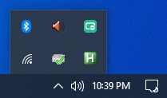
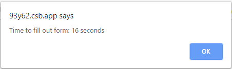

As a developer, have you ever been pushed to the brink of your sanity by having to re-enter form data each time you change a small detail of your application? I know I have. If you are a developer using _Windows_ this post has some good news for you. [AutoHotkey](https://www.autohotkey.com/) can save you a lot of time and help reduce the brain 🤯 pain associated with tedious data entry.

_AutoHotkey_ is a free and open-source scripting language that can do all kinds of things, from simple form filling to much more complex tasks we aren't focused on. I stumbled onto their site and was hesitant at first. The last thing I wanted to do was get side tracked learning a new language. As it turns out, to use _AutoHotkey_ for our purposes very little knowledge of the language is required.

Recently I found myself working on an ecommerce website that really tested my nerves. I was using [Stripe](https://stripe.com/) and had to build my app to handle various scenarios based on the input provided by the user purchasing a product. _Stripe_ provides a great platform and great testing tools but I found myself having to fill out the [Stripe Checkout](https://www.npmjs.com/package/react-stripe-checkout) form over and over and over again.

I build an example on [Code Sandbox](https://codesandbox.io) to illustrate my point. This mini-app tracks the time it takes to fill out the form. Use `4242 4242 4242 4242` as the card number (the _Stripe_ testing code for a successful transaction).

<iframe src="https://codesandbox.io/embed/quirky-sanderson-93y62?fontsize=14&view=preview" title="Auto Hotkeys Blog Post" allow="geolocation; microphone; camera; midi; vr; accelerometer; gyroscope; payment; ambient-light-sensor; encrypted-media" style="width:100%; height:500px; border:0; border-radius: 4px; overflow:hidden;" sandbox="allow-modals allow-forms allow-popups allow-scripts allow-same-origin"></iframe>

The _Stripe Checkout_ form requires the following input:

- Name
- Street Address
- City
- Zip Code
- Card Number
- Card Expiration
- Card CVV

The above list is bad enough on its own but gets even worse if the _Shipping_ and _Billing_ information are different. Even when keeping both addresses the same it look me around 36 seconds to fill in my own information and after two rounds my patience was already wearing thin.

Enter _AutoHotkey_. To get started just [download the current version](https://www.autohotkey.com/). Once installed you now have the ability to create, edit and run _AutoHotkey_ scripts. Our goal in this article is to create and run a script that will help us fill out our annoying form. To create this script simply right-click the _Desktop_ and select `New` then `AutoHotkey Script`. This should create a new icon on the _Desktop_ with an `ahk` extension. Next right-click the new icon and select `Edit Script`. This should open _Notepad_ and look something like this.


The script has some default boilerplate which we can just ignore. To get an idea of how our script will work lets create our first _HotString_. A _HotString_ is used to expand an abbreviation into a full blown string. Sounds pretty darn good for our use case. To understand how this works just add a new line of code to the script file.

```simple
::cc::4242424242424242
```

Tada. Now we have a basic _HotString_. The letters inside the `::` represent the abbreviatation that will trigger _AutoHotkey_ to replace `cc` with `4242424242424242`. To test our script just save the file and double-click the desktop icon. To make sure our script is running check the _Tray_ in the bottom right corner of the screen. You should see the _AutoHotkey_ logo. As long as our script is running our _HotString_ will work by typing `cc` followed by either `Enter` or `Tab` to trigger the expansion.



If all is well we can now create _HotStrings_ for the rest of the annoying form fields we need. In my opinion all the fields could be included with the exception of `Card CVV` and possiblly `Card Expiration` or `Zip Code`. For the sake of the article I made _HotStrings_ for everything. You can edit a running script but make sure to right-click the tray icon and click `Reload This Script` for changes to take effect. Naturally, feel free to make the abbreviations any characters you want.

```simple
::nm::Benjamin Brooke
::st::123 Kerckhoff Ave.
::ct::Los Angeles
::zp::90731
::cc::4242424242424242
::ce::01/20
::cv::123
```

With new _HotString_ powers at the tip of our fingers filling out tedious forms is a breeze. The proof is in the pudding as they say. I was able to complete the form in half the time it took me without _HotStrings_.



To take things to another level it is possible to remove the need for a trigger key. I our case, using the `Tab` key makes sense since it moves focus to the next field, but to be fully streamlined just add an `*` to each _HotString_ between the first set of colons.

```simple
:*:nm::Benjamin Brooke
:*:st::123 Kerckhoff Ave.
:*:ct::Los Angeles
:*:zp::90731
:*:cc::4242424242424242
:*:ce::01/20
:*:cv::123
```

While learning new systems and languages is often painful and time consuming sometimes taking a few hours to familiarize one's self with a new tool is worth it for sanity sake alone. This article barely scratches the surface of what _AutoHotkey_ can do. Check out their extensive documentation and get back to me with any cool hacks that you find.
