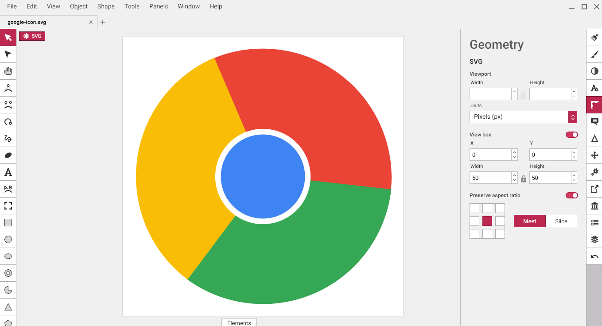
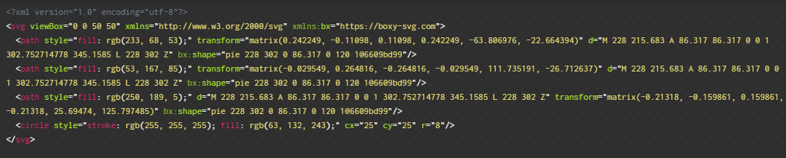
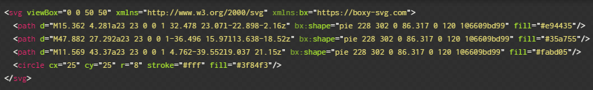

Are you sick of the icons you have been using in your projects lately? Do you lack the artistic ability to draw a stick figure? If you answered yes (or no), please continue reading.

Since I began building things with **JavaScript** I have been using essentially the same icon set over and over. I often work with [React](https://reactjs.org/) and [Styled Components](https://www.styled-components.com/) so my go-to icon library has been [Styled Icons](https://styled-icons.js.org/). _Styled Icons_ contains the same familiar icon sets we have probably all used at some point: _Font Awesome_, _Material Design_, _Boxicons_, etc. Even though there are thousands of choices and all of these icon collections are great in their own right, I got to the point where I couldn't find the right icons for my use cases and all my projects sort of looked the same. I thought creating my own icon set was way out of reach due to my complete lack of artistic talent. Turns out I was wrong.

Example _Boxicons_ **Chromium** icon

<svg viewBox="0 0 24 24" width="300">
  <path d="M10.742 2.04c-1.404.183-3.06.808-4.281 1.626-1.01.664-2.397 2.02-2.309 2.251.193.501 3.28 5.658 3.33 5.562.038-.067.095-.279.123-.49.25-1.385 1.425-2.704 2.897-3.253.568-.221.683-.221 5.495-.27l4.917-.047-.395-.646c-1.385-2.26-3.522-3.819-6.197-4.512-.731-.193-2.81-.318-3.58-.22z" />
  <path d="M3.2 7.217c-.453.799-.983 2.415-1.107 3.358-.588 4.273 1.568 8.4 5.379 10.315.894.452 2.174.885 2.732.933l.356.029 1.674-2.838c.915-1.559 1.655-2.849 1.636-2.868-.02-.019-.231.039-.481.125-1.569.53-3.387.086-4.57-1.116-.424-.424-1.002-1.357-2.84-4.542C4.71 8.41 3.642 6.601 3.603 6.601c-.028 0-.211.279-.403.616z"/>
  <path d="M15.15 8.804c1.222 1.242 1.655 3.003 1.116 4.59-.086.26-1.212 2.271-2.501 4.485-1.29 2.203-2.349 4.031-2.349 4.06 0 .115 1.328.057 2.175-.087 4.32-.74 7.573-4.002 8.265-8.276.26-1.558.164-2.925-.307-4.503l-.25-.837h-6.707l.557.568z"></path><path d="M10.608 8.563C9.598 8.987 8.905 9.7 8.53 10.71c-.173.453-.202.713-.173 1.424.03.75.068.963.347 1.511.366.75.962 1.329 1.751 1.703.462.221.654.25 1.54.25.895 0 1.077-.029 1.559-.26.712-.326 1.462-1.077 1.79-1.79.23-.48.259-.663.259-1.558 0-.886-.029-1.078-.25-1.54-.375-.788-.952-1.386-1.703-1.75-.568-.28-.742-.318-1.56-.348-.788-.019-.99.01-1.48.213z"/>
</svg>

<svg viewBox="0 0 24 24" width="200">
  <path d="M10.742 2.04c-1.404.183-3.06.808-4.281 1.626-1.01.664-2.397 2.02-2.309 2.251.193.501 3.28 5.658 3.33 5.562.038-.067.095-.279.123-.49.25-1.385 1.425-2.704 2.897-3.253.568-.221.683-.221 5.495-.27l4.917-.047-.395-.646c-1.385-2.26-3.522-3.819-6.197-4.512-.731-.193-2.81-.318-3.58-.22z" />
  <path d="M3.2 7.217c-.453.799-.983 2.415-1.107 3.358-.588 4.273 1.568 8.4 5.379 10.315.894.452 2.174.885 2.732.933l.356.029 1.674-2.838c.915-1.559 1.655-2.849 1.636-2.868-.02-.019-.231.039-.481.125-1.569.53-3.387.086-4.57-1.116-.424-.424-1.002-1.357-2.84-4.542C4.71 8.41 3.642 6.601 3.603 6.601c-.028 0-.211.279-.403.616z"/>
  <path d="M15.15 8.804c1.222 1.242 1.655 3.003 1.116 4.59-.086.26-1.212 2.271-2.501 4.485-1.29 2.203-2.349 4.031-2.349 4.06 0 .115 1.328.057 2.175-.087 4.32-.74 7.573-4.002 8.265-8.276.26-1.558.164-2.925-.307-4.503l-.25-.837h-6.707l.557.568z"></path><path d="M10.608 8.563C9.598 8.987 8.905 9.7 8.53 10.71c-.173.453-.202.713-.173 1.424.03.75.068.963.347 1.511.366.75.962 1.329 1.751 1.703.462.221.654.25 1.54.25.895 0 1.077-.029 1.559-.26.712-.326 1.462-1.077 1.79-1.79.23-.48.259-.663.259-1.558 0-.886-.029-1.078-.25-1.54-.375-.788-.952-1.386-1.703-1.75-.568-.28-.742-.318-1.56-.348-.788-.019-.99.01-1.48.213z"/>
</svg>

<svg viewBox="0 0 24 24" width="100">
  <path d="M10.742 2.04c-1.404.183-3.06.808-4.281 1.626-1.01.664-2.397 2.02-2.309 2.251.193.501 3.28 5.658 3.33 5.562.038-.067.095-.279.123-.49.25-1.385 1.425-2.704 2.897-3.253.568-.221.683-.221 5.495-.27l4.917-.047-.395-.646c-1.385-2.26-3.522-3.819-6.197-4.512-.731-.193-2.81-.318-3.58-.22z" />
  <path d="M3.2 7.217c-.453.799-.983 2.415-1.107 3.358-.588 4.273 1.568 8.4 5.379 10.315.894.452 2.174.885 2.732.933l.356.029 1.674-2.838c.915-1.559 1.655-2.849 1.636-2.868-.02-.019-.231.039-.481.125-1.569.53-3.387.086-4.57-1.116-.424-.424-1.002-1.357-2.84-4.542C4.71 8.41 3.642 6.601 3.603 6.601c-.028 0-.211.279-.403.616z"/>
  <path d="M15.15 8.804c1.222 1.242 1.655 3.003 1.116 4.59-.086.26-1.212 2.271-2.501 4.485-1.29 2.203-2.349 4.031-2.349 4.06 0 .115 1.328.057 2.175-.087 4.32-.74 7.573-4.002 8.265-8.276.26-1.558.164-2.925-.307-4.503l-.25-.837h-6.707l.557.568z"></path><path d="M10.608 8.563C9.598 8.987 8.905 9.7 8.53 10.71c-.173.453-.202.713-.173 1.424.03.75.068.963.347 1.511.366.75.962 1.329 1.751 1.703.462.221.654.25 1.54.25.895 0 1.077-.029 1.559-.26.712-.326 1.462-1.077 1.79-1.79.23-.48.259-.663.259-1.558 0-.886-.029-1.078-.25-1.54-.375-.788-.952-1.386-1.703-1.75-.568-.28-.742-.318-1.56-.348-.788-.019-.99.01-1.48.213z"/>
</svg>

<svg viewBox="0 0 24 24" width="50">
  <path d="M10.742 2.04c-1.404.183-3.06.808-4.281 1.626-1.01.664-2.397 2.02-2.309 2.251.193.501 3.28 5.658 3.33 5.562.038-.067.095-.279.123-.49.25-1.385 1.425-2.704 2.897-3.253.568-.221.683-.221 5.495-.27l4.917-.047-.395-.646c-1.385-2.26-3.522-3.819-6.197-4.512-.731-.193-2.81-.318-3.58-.22z" />
  <path d="M3.2 7.217c-.453.799-.983 2.415-1.107 3.358-.588 4.273 1.568 8.4 5.379 10.315.894.452 2.174.885 2.732.933l.356.029 1.674-2.838c.915-1.559 1.655-2.849 1.636-2.868-.02-.019-.231.039-.481.125-1.569.53-3.387.086-4.57-1.116-.424-.424-1.002-1.357-2.84-4.542C4.71 8.41 3.642 6.601 3.603 6.601c-.028 0-.211.279-.403.616z"/>
  <path d="M15.15 8.804c1.222 1.242 1.655 3.003 1.116 4.59-.086.26-1.212 2.271-2.501 4.485-1.29 2.203-2.349 4.031-2.349 4.06 0 .115 1.328.057 2.175-.087 4.32-.74 7.573-4.002 8.265-8.276.26-1.558.164-2.925-.307-4.503l-.25-.837h-6.707l.557.568z"></path><path d="M10.608 8.563C9.598 8.987 8.905 9.7 8.53 10.71c-.173.453-.202.713-.173 1.424.03.75.068.963.347 1.511.366.75.962 1.329 1.751 1.703.462.221.654.25 1.54.25.895 0 1.077-.029 1.559-.26.712-.326 1.462-1.077 1.79-1.79.23-.48.259-.663.259-1.558 0-.886-.029-1.078-.25-1.54-.375-.788-.952-1.386-1.703-1.75-.568-.28-.742-.318-1.56-.348-.788-.019-.99.01-1.48.213z"/>
</svg>

<svg viewBox="0 0 24 24" width="25">
  <path d="M10.742 2.04c-1.404.183-3.06.808-4.281 1.626-1.01.664-2.397 2.02-2.309 2.251.193.501 3.28 5.658 3.33 5.562.038-.067.095-.279.123-.49.25-1.385 1.425-2.704 2.897-3.253.568-.221.683-.221 5.495-.27l4.917-.047-.395-.646c-1.385-2.26-3.522-3.819-6.197-4.512-.731-.193-2.81-.318-3.58-.22z" />
  <path d="M3.2 7.217c-.453.799-.983 2.415-1.107 3.358-.588 4.273 1.568 8.4 5.379 10.315.894.452 2.174.885 2.732.933l.356.029 1.674-2.838c.915-1.559 1.655-2.849 1.636-2.868-.02-.019-.231.039-.481.125-1.569.53-3.387.086-4.57-1.116-.424-.424-1.002-1.357-2.84-4.542C4.71 8.41 3.642 6.601 3.603 6.601c-.028 0-.211.279-.403.616z"/>
  <path d="M15.15 8.804c1.222 1.242 1.655 3.003 1.116 4.59-.086.26-1.212 2.271-2.501 4.485-1.29 2.203-2.349 4.031-2.349 4.06 0 .115 1.328.057 2.175-.087 4.32-.74 7.573-4.002 8.265-8.276.26-1.558.164-2.925-.307-4.503l-.25-.837h-6.707l.557.568z"></path><path d="M10.608 8.563C9.598 8.987 8.905 9.7 8.53 10.71c-.173.453-.202.713-.173 1.424.03.75.068.963.347 1.511.366.75.962 1.329 1.751 1.703.462.221.654.25 1.54.25.895 0 1.077-.029 1.559-.26.712-.326 1.462-1.077 1.79-1.79.23-.48.259-.663.259-1.558 0-.886-.029-1.078-.25-1.54-.375-.788-.952-1.386-1.703-1.75-.568-.28-.742-.318-1.56-.348-.788-.019-.99.01-1.48.213z"/>
</svg>

<svg viewBox="0 0 24 24" width="10">
  <path d="M10.742 2.04c-1.404.183-3.06.808-4.281 1.626-1.01.664-2.397 2.02-2.309 2.251.193.501 3.28 5.658 3.33 5.562.038-.067.095-.279.123-.49.25-1.385 1.425-2.704 2.897-3.253.568-.221.683-.221 5.495-.27l4.917-.047-.395-.646c-1.385-2.26-3.522-3.819-6.197-4.512-.731-.193-2.81-.318-3.58-.22z" />
  <path d="M3.2 7.217c-.453.799-.983 2.415-1.107 3.358-.588 4.273 1.568 8.4 5.379 10.315.894.452 2.174.885 2.732.933l.356.029 1.674-2.838c.915-1.559 1.655-2.849 1.636-2.868-.02-.019-.231.039-.481.125-1.569.53-3.387.086-4.57-1.116-.424-.424-1.002-1.357-2.84-4.542C4.71 8.41 3.642 6.601 3.603 6.601c-.028 0-.211.279-.403.616z"/>
  <path d="M15.15 8.804c1.222 1.242 1.655 3.003 1.116 4.59-.086.26-1.212 2.271-2.501 4.485-1.29 2.203-2.349 4.031-2.349 4.06 0 .115 1.328.057 2.175-.087 4.32-.74 7.573-4.002 8.265-8.276.26-1.558.164-2.925-.307-4.503l-.25-.837h-6.707l.557.568z"></path><path d="M10.608 8.563C9.598 8.987 8.905 9.7 8.53 10.71c-.173.453-.202.713-.173 1.424.03.75.068.963.347 1.511.366.75.962 1.329 1.751 1.703.462.221.654.25 1.54.25.895 0 1.077-.029 1.559-.26.712-.326 1.462-1.077 1.79-1.79.23-.48.259-.663.259-1.558 0-.886-.029-1.078-.25-1.54-.375-.788-.952-1.386-1.703-1.75-.568-.28-.742-.318-1.56-.348-.788-.019-.99.01-1.48.213z"/>
</svg>

<svg viewBox="0 0 24 24" width="5">
  <path d="M10.742 2.04c-1.404.183-3.06.808-4.281 1.626-1.01.664-2.397 2.02-2.309 2.251.193.501 3.28 5.658 3.33 5.562.038-.067.095-.279.123-.49.25-1.385 1.425-2.704 2.897-3.253.568-.221.683-.221 5.495-.27l4.917-.047-.395-.646c-1.385-2.26-3.522-3.819-6.197-4.512-.731-.193-2.81-.318-3.58-.22z" />
  <path d="M3.2 7.217c-.453.799-.983 2.415-1.107 3.358-.588 4.273 1.568 8.4 5.379 10.315.894.452 2.174.885 2.732.933l.356.029 1.674-2.838c.915-1.559 1.655-2.849 1.636-2.868-.02-.019-.231.039-.481.125-1.569.53-3.387.086-4.57-1.116-.424-.424-1.002-1.357-2.84-4.542C4.71 8.41 3.642 6.601 3.603 6.601c-.028 0-.211.279-.403.616z"/>
  <path d="M15.15 8.804c1.222 1.242 1.655 3.003 1.116 4.59-.086.26-1.212 2.271-2.501 4.485-1.29 2.203-2.349 4.031-2.349 4.06 0 .115 1.328.057 2.175-.087 4.32-.74 7.573-4.002 8.265-8.276.26-1.558.164-2.925-.307-4.503l-.25-.837h-6.707l.557.568z"></path><path d="M10.608 8.563C9.598 8.987 8.905 9.7 8.53 10.71c-.173.453-.202.713-.173 1.424.03.75.068.963.347 1.511.366.75.962 1.329 1.751 1.703.462.221.654.25 1.54.25.895 0 1.077-.029 1.559-.26.712-.326 1.462-1.077 1.79-1.79.23-.48.259-.663.259-1.558 0-.886-.029-1.078-.25-1.54-.375-.788-.952-1.386-1.703-1.75-.568-.28-.742-.318-1.56-.348-.788-.019-.99.01-1.48.213z"/>
</svg>

The solution to my problem was [**Scalable Vector Graphics**](https://en.wikipedia.org/wiki/Scalable_Vector_Graphics), or **SVG**. To get started you will need some kind of SVG editor. Here is [a list of 7 free SVG editors](https://www.maketecheasier.com/free-graphic-editor-for-creating-vector-image/). My personal preference is [Boxy SVG](https://boxy-svg.com/), but I haven't tried any others <span role='img' aria-label='eye roll'>🙄</span>. The great part about SVGs is that mathematical skills are more important than artistic skills. _Boxy SVG_ has a ton of settings/options and taking the time to familiarize yourself with them is worthwhile. Here are the steps I take to create my icons with a few tips based on my experience.

---

## Step 1 - Draw an icon

- Change the dimensions of the canvas to **50px** by **50px**
- _Geometry_ options help size and position elements
- Backgrounds will be _transparent_ unless you set the **fill** attribute

I used the _Circle_ and the _Pie_ tool to create this:

- Hints
  - Make one 120 degree pie piece
  - Copy and Paste it two times
  - Rotate the pieces to fit
  - Put a circle on top of that
  - The inner circle has a 1px white **stroke**
  - Match colors with a [Color Dropper Tool](https://github.com/benjaminadk/color-tool-remix)



---

## Step 2 - Optimize your SVG

- Save your icon as an `svg` file
- Go to [OMGSVG](https://jakearchibald.github.io/svgomg/) and open your file. This web app is a cool utility that simplifies the markup required to render your svg.
- Change settings and toggle the _Show Original_ button to see the difference
- _Image_ / _Markup_ tabs while _both_ change based on settings
- I generally use defaults and with _Prettify Markup_ but customize when needed

The more complex your SVG the more dramatic the optimization:

Original


Optimized


An SVG looks great no matter what the size

<svg width='300' viewBox="0 0 50 50">
  <path d="M15.362 4.281a23 23 0 0 1 32.478 23.07l-22.898-2.16z" fill="#e94435"/>
  <path d="M47.882 27.292a23 23 0 0 1-36.496 15.97l13.638-18.52z" fill="#35a755"/>
  <path d="M11.569 43.37a23 23 0 0 1 4.762-39.552l9.037 21.15z" fill="#fabd05"/>
  <circle cx="25" cy="25" r="8" stroke="#fff" fill="#3f84f3"/>
</svg>

<svg width='200' viewBox="0 0 50 50">
  <path d="M15.362 4.281a23 23 0 0 1 32.478 23.07l-22.898-2.16z" fill="#e94435"/>
  <path d="M47.882 27.292a23 23 0 0 1-36.496 15.97l13.638-18.52z" fill="#35a755"/>
  <path d="M11.569 43.37a23 23 0 0 1 4.762-39.552l9.037 21.15z" fill="#fabd05"/>
  <circle cx="25" cy="25" r="8" stroke="#fff" fill="#3f84f3"/>
</svg>

<svg width='100' viewBox="0 0 50 50">
  <path d="M15.362 4.281a23 23 0 0 1 32.478 23.07l-22.898-2.16z" fill="#e94435"/>
  <path d="M47.882 27.292a23 23 0 0 1-36.496 15.97l13.638-18.52z" fill="#35a755"/>
  <path d="M11.569 43.37a23 23 0 0 1 4.762-39.552l9.037 21.15z" fill="#fabd05"/>
  <circle cx="25" cy="25" r="8" stroke="#fff" fill="#3f84f3"/>
</svg>

<svg width='50' viewBox="0 0 50 50">
  <path d="M15.362 4.281a23 23 0 0 1 32.478 23.07l-22.898-2.16z" fill="#e94435"/>
  <path d="M47.882 27.292a23 23 0 0 1-36.496 15.97l13.638-18.52z" fill="#35a755"/>
  <path d="M11.569 43.37a23 23 0 0 1 4.762-39.552l9.037 21.15z" fill="#fabd05"/>
  <circle cx="25" cy="25" r="8" stroke="#fff" fill="#3f84f3"/>
</svg>

<svg width='25' viewBox="0 0 50 50">
  <path d="M15.362 4.281a23 23 0 0 1 32.478 23.07l-22.898-2.16z" fill="#e94435"/>
  <path d="M47.882 27.292a23 23 0 0 1-36.496 15.97l13.638-18.52z" fill="#35a755"/>
  <path d="M11.569 43.37a23 23 0 0 1 4.762-39.552l9.037 21.15z" fill="#fabd05"/>
  <circle cx="25" cy="25" r="8" stroke="#fff" fill="#3f84f3"/>
</svg>

<svg width='10' viewBox="0 0 50 50">
  <path d="M15.362 4.281a23 23 0 0 1 32.478 23.07l-22.898-2.16z" fill="#e94435"/>
  <path d="M47.882 27.292a23 23 0 0 1-36.496 15.97l13.638-18.52z" fill="#35a755"/>
  <path d="M11.569 43.37a23 23 0 0 1 4.762-39.552l9.037 21.15z" fill="#fabd05"/>
  <circle cx="25" cy="25" r="8" stroke="#fff" fill="#3f84f3"/>
</svg>

<svg width='5' viewBox="0 0 50 50">
  <path d="M15.362 4.281a23 23 0 0 1 32.478 23.07l-22.898-2.16z" fill="#e94435"/>
  <path d="M47.882 27.292a23 23 0 0 1-36.496 15.97l13.638-18.52z" fill="#35a755"/>
  <path d="M11.569 43.37a23 23 0 0 1 4.762-39.552l9.037 21.15z" fill="#fabd05"/>
  <circle cx="25" cy="25" r="8" stroke="#fff" fill="#3f84f3"/>
</svg>

Out final markup looks like this:

- Drop all the `xmln` stuff since we are using these with **inline HTML**
- Add a `width` attribute to the SVG or use **CSS** to style

```jsx
// Cleaned up SVG markup
<svg width='200' viewBox='0 0 50 50'>
  <path d='M15.362 4.281a23 23 0 0 1 32.478 23.07l-22.898-2.16z' fill='#e94435' />
  <path d='M47.882 27.292a23 23 0 0 1-36.496 15.97l13.638-18.52z' fill='#35a755' />
  <path d='M11.569 43.37a23 23 0 0 1 4.762-39.552l9.037 21.15z' fill='#fabd05' />
  <circle cx='25' cy='25' r='8' stroke='#fff' fill='#3f84f3' />
</svg>
```

---

## Step 3 - Create a Reusable React Component

- `Svg` component will take `name` as _props_
- The `name` prop will tell `Svg` what markup to return
- Use `React.Fragment` shorthand `<></>` to return output

<div class='filename'>Svg.js</div>

```js
import React from 'react'

// Pass any additional props via destructuring ...rest
function Svg({ name, ...rest }) {
  // Helper function to return inner svg elements
  // Each icon has its own case
  // Throws error if no name prop is present
  const getPath = n => {
    switch (n) {
      case 'google':
        return (
          <>
            <path d='M15.362 4.281a23 23 0 0 1 32.478 23.07l-22.898-2.16z' fill='#e94435' />
            <path d='M47.882 27.292a23 23 0 0 1-36.496 15.97l13.638-18.52z' fill='#35a755' />
            <path d='M11.569 43.37a23 23 0 0 1 4.762-39.552l9.037 21.15z' fill='#fabd05' />
            <circle cx='25' cy='25' r='8' stroke='#fff' fill='#3f84f3' />
          </>
        )
      default:
        throw Error('name is required!')
    }
  }

  return (
    <svg viewBox='0 0 50 50' {...rest}>
      {getPath(name)}
    </svg>
  )
}

export default Svg
```

- Add as many icons as you need
- Use like any other **React** component

---

## Step 4 - Other Ideas

- Set size via passing a `width` / `height` prop or via _CSS_ or however you style things
- Pass `fill` or `stroke` as a prop to change up colors

Now we have the **Chromium** icon <span role='img' aria-label='sparkles'>✨</span>:

<svg width='300' viewBox='0 0 50 50'>
  <path d='M15.362 4.281a23 23 0 0 1 32.478 23.07l-22.898-2.16z' fill='#376BD2' />
  <path d='M47.882 27.292a23 23 0 0 1-36.496 15.97l13.638-18.52z' fill='#9DBDF0' />
  <path d='M11.569 43.37a23 23 0 0 1 4.762-39.552l9.037 21.15z' fill='#5B92EC' />
  <circle cx='25' cy='25' r='8' stroke='#fff' fill='#3f84f3' />
</svg>

<svg width='200' viewBox='0 0 50 50'>
  <path d='M15.362 4.281a23 23 0 0 1 32.478 23.07l-22.898-2.16z' fill='#376BD2' />
  <path d='M47.882 27.292a23 23 0 0 1-36.496 15.97l13.638-18.52z' fill='#9DBDF0' />
  <path d='M11.569 43.37a23 23 0 0 1 4.762-39.552l9.037 21.15z' fill='#5B92EC' />
  <circle cx='25' cy='25' r='8' stroke='#fff' fill='#3f84f3' />
</svg>

<svg width='100' viewBox='0 0 50 50'>
  <path d='M15.362 4.281a23 23 0 0 1 32.478 23.07l-22.898-2.16z' fill='#376BD2' />
  <path d='M47.882 27.292a23 23 0 0 1-36.496 15.97l13.638-18.52z' fill='#9DBDF0' />
  <path d='M11.569 43.37a23 23 0 0 1 4.762-39.552l9.037 21.15z' fill='#5B92EC' />
  <circle cx='25' cy='25' r='8' stroke='#fff' fill='#3f84f3' />
</svg>

<svg width='50' viewBox='0 0 50 50'>
  <path d='M15.362 4.281a23 23 0 0 1 32.478 23.07l-22.898-2.16z' fill='#376BD2' />
  <path d='M47.882 27.292a23 23 0 0 1-36.496 15.97l13.638-18.52z' fill='#9DBDF0' />
  <path d='M11.569 43.37a23 23 0 0 1 4.762-39.552l9.037 21.15z' fill='#5B92EC' />
  <circle cx='25' cy='25' r='8' stroke='#fff' fill='#3f84f3' />
</svg>

<svg width='25' viewBox='0 0 50 50'>
  <path d='M15.362 4.281a23 23 0 0 1 32.478 23.07l-22.898-2.16z' fill='#376BD2' />
  <path d='M47.882 27.292a23 23 0 0 1-36.496 15.97l13.638-18.52z' fill='#9DBDF0' />
  <path d='M11.569 43.37a23 23 0 0 1 4.762-39.552l9.037 21.15z' fill='#5B92EC' />
  <circle cx='25' cy='25' r='8' stroke='#fff' fill='#3f84f3' />
</svg>

<svg width='10' viewBox='0 0 50 50'>
  <path d='M15.362 4.281a23 23 0 0 1 32.478 23.07l-22.898-2.16z' fill='#376BD2' />
  <path d='M47.882 27.292a23 23 0 0 1-36.496 15.97l13.638-18.52z' fill='#9DBDF0' />
  <path d='M11.569 43.37a23 23 0 0 1 4.762-39.552l9.037 21.15z' fill='#5B92EC' />
  <circle cx='25' cy='25' r='8' stroke='#fff' fill='#3f84f3' />
</svg>

<svg width='5' viewBox='0 0 50 50'>
  <path d='M15.362 4.281a23 23 0 0 1 32.478 23.07l-22.898-2.16z' fill='#376BD2' />
  <path d='M47.882 27.292a23 23 0 0 1-36.496 15.97l13.638-18.52z' fill='#9DBDF0' />
  <path d='M11.569 43.37a23 23 0 0 1 4.762-39.552l9.037 21.15z' fill='#5B92EC' />
  <circle cx='25' cy='25' r='8' stroke='#fff' fill='#3f84f3' />
</svg>

- To simplify the concept lets add a `dot` icon

If our new component looked like this:

```js
function Svg({ name, fill = 'black' }) {
  const getPath = n => {
    switch (n) {
      case 'dot':
        return (
          <>
            <circle cx='25' cy='25' r='8' fill={fill} />
          </>
        )
      case 'google':
        return (
          <>
            <path d='M15.362 4.281a23 23 0 0 1 32.478 23.07l-22.898-2.16z' fill='#e94435' />
            <path d='M47.882 27.292a23 23 0 0 1-36.496 15.97l13.638-18.52z' fill='#35a755' />
            <path d='M11.569 43.37a23 23 0 0 1 4.762-39.552l9.037 21.15z' fill='#fabd05' />
            <circle cx='25' cy='25' r='8' stroke='#fff' fill='#3f84f3' />
          </>
        )
      default:
        throw Error('name is required!')
    }
  }

  return <svg viewBox='0 0 50 50'>{getPath(name)}</svg>
}
```

We could have _React_ code like this:

```js
<>
  <Svg name='dot' />
  <Svg name='dot' fill='rebeccapurple' />
  <Svg name='dot' fill='orangered' />
  <Svg name='dot' fill='greenyellow' />
</>
```

And render:

<svg width='100px' viewBox='0 0 50 50'>
  <circle cx='25' cy='25' r='8' fill='black' />
</svg>

<svg width='100px' viewBox='0 0 50 50'>
  <circle cx='25' cy='25' r='8' fill='rebeccapurple' />
</svg>

<svg width='100px' viewBox='0 0 50 50'>
  <circle cx='25' cy='25' r='8' fill='orangered' />
</svg>

<svg width='100px' viewBox='0 0 50 50'>
  <circle cx='25' cy='25' r='8' fill='greenyellow' />
</svg>

---

## In Closing

Now you know how to make your own icons and turn them into an easy-to-use _React_ component. Hopefully, you agree with my premise that minimal artistic ability is required. I would argue the most important skill is understanding the features of your preferred SVG editor. There is a time investment here but I use working on these icons as a break from the more mind crunching code of my main projects. I think the result is websites and applications that look better and are more engaging for the user.

---

### Examples From My Last Project

<svg width='100px' viewBox='0 0 50 50' style='margin-right: 20px;'>
  <path 
    d='M28.3205 35.111l-.968 2.3854 2.4847 4.099a15.2927 15.2927 0 0 1-2.5236 2.5603l-4.1344-2.4255-2.3711 1.0022-1.1415 4.6555a15.2927 15.2927 0 0 1-3.5949.0258l-1.2084-4.6385-2.3853-.968-4.099 2.4848a15.2927 15.2927 0 0 1-2.5603-2.5236l2.4255-4.1345-1.0022-2.371-4.6556-1.1416a15.2927 15.2927 0 0 1-.0258-3.5948l4.6386-1.2084.968-2.3853-2.4848-4.099a15.2927 15.2927 0 0 1 2.5236-2.5604l4.1344 2.4255 2.3711-1.0022 1.1415-4.6555a15.2927 15.2927 0 0 1 3.5949-.0258l1.2084 4.6385 2.3853.968 4.099-2.4848a15.2927 15.2927 0 0 1 2.5603 2.5236l-2.4255 4.1345 1.0022 2.3711 4.6556 1.1415a15.2927 15.2927 0 0 1 .0258 3.5949zm-5.8373-.9797a5.0975 5.0975 0 0 0-9.4468-3.8335 5.0975 5.0975 0 0 0 9.4468 3.8335M41.865 13.4854l-.6726 1.6573 1.7263 2.848a10.625 10.625 0 0 1-1.7533 1.7788l-2.8726-1.6853-1.6474.6963-.7931 3.2346a10.625 10.625 0 0 1-2.4977.0179l-.8395-3.2228-1.6573-.6725-2.848 1.7263a10.625 10.625 0 0 1-1.7787-1.7534l1.6852-2.8725-.6963-1.6474-3.2346-.7931a10.625 10.625 0 0 1-.0179-2.4977l3.2228-.8395.6725-1.6573-1.7263-2.848A10.625 10.625 0 0 1 27.89 3.1764l2.8725 1.6853 1.6474-.6963.7931-3.2346a10.625 10.625 0 0 1 2.4977-.0179l.8395 3.2228 1.6573.6725 2.848-1.7263a10.625 10.625 0 0 1 1.7788 1.7534L41.139 7.7077l.6962 1.6474 3.2346.7931a10.625 10.625 0 0 1 .018 2.4977zm-4.0556-.6807a3.5417 3.5417 0 0 0-6.5635-2.6636 3.5417 3.5417 0 0 0 6.5635 2.6636'
    fill='#989898'
  />
</svg>

<svg width='100px' viewBox='0 0 50 50' style='margin-right: 20px;'>
  <path d='M32.9747 9.6683l-.001 30 17 .0006-16.999-30.0006z' fill='gray' />
  <path d='M2.059 39.1732l28 .0017.001-16L2.059 39.1732z' fill='#fff' stroke='gray' />
  <path
    d='M15.339 17.463v4.397l15.316-7.524-15.317-7.525.001 4.397H8.05v.035c-3.473.048-6.216 4.1-6.129 9.178l6.44.121.011-3.079z'
    fill='#407eb5'
  />
</svg>

<svg width='100px' viewBox='0 0 50 50' style='margin-right: 20px;'>
  <path
    d='M16.0654 33.180099999999996a7.609 7.609 0 1 0-5.583 14.1568 7.609 7.609 0 1 0 5.583-14.1568zM14.5799 36.9467a3.56 3.56 0 0 1-2.612 6.6236 3.56 3.56 0 0 1 2.612-6.6236z'
    fill='#407eb5'
  />
  <path
    d='M12.953 30.253l2.847-.964L30.969 5.856l.077.041.082-.122-.013-.008 4.356-3.701.007 6.313h-.052L20.383 31.617l1.209 3.026z'
    fill='gray'
  />
  <path
    d='M36.144 30.078l-2.847-.961L18.128 5.74l-.077.041-.082-.123.013-.007-4.356-3.693-.007 6.299h.052l15.043 23.181-1.209 3.018z'
    fill='gray'
  />
  <path
    d='M38.0995 33.047999999999995a7.609 7.609 0 1 0-5.583 14.1569 7.609 7.609 0 1 0 5.583-14.157zm-1.4855 3.7667a3.56 3.56 0 0 1-2.612 6.6235 3.56 3.56 0 0 1 2.612-6.6235z'
    fill='#407eb5'
  />
</svg>

<svg width='100px' viewBox='0 0 50 50' style='margin-right: 20px;'>
  <path
    strokeWidth='.75'
    fill='#ffffff'
    stroke='#333333'
    d='M3.321 3.217h43.405v43.405H3.321z'
  />
  <path
    d='M14.228 16.264c1.342-1.646 2.689-1.648 4.036-.006l8.334 10.108-.007.005 15.71 19.383H23.944v-.011l-19.793.043V28.581zm19.792 4.045c1.343-1.644 2.689-1.646 4.041-.009l7.815 9.485v15.969h-2.511L28.356 27.236z'
    fill='#407eb5'
  />
  <circle cx='38.955' cy='10.122' r='4.865' fill='#efc380' />
</svg>

<svg width='100px' viewBox='0 0 50 50' style='margin-right: 20px;'>
  <path
    d='M34.491 1.277L46.858 12.32c1.547 1.382 1.681 3.756.299 5.303L25.352 42.041 7.651 25.693 29.188 1.576c1.381-1.547 3.756-1.681 5.303-.299zM20.439 47.543c-1.381 1.548-3.756 1.682-5.303.3L2.769 36.8c-1.547-1.382-1.681-3.756-.3-5.304l3.941-4.413 17.701 16.348z'
    fill='#fba7b1'
  />
</svg>

<svg width='100px' viewBox='0 0 50 50' style='margin-right: 20px;'>
  <path fill='gray' d='M0 0h16.7v16.7H0z' />
  <path fill='#fff' d='M0 16.7h16.7v16.7H0z' />
  <path fill='gray' d='M0 33.4h16.7v16.7H0z' />
  <path fill='#fff' d='M16.7 0h16.7v16.7H16.7z' />
  <path fill='gray' d='M16.7 16.7h16.7v16.7H16.7z' />
  <path fill='#fff' d='M16.7 33.4h16.7v16.7H16.7z' />
  <path fill='gray' d='M33.4 0h16.7v16.7H33.4z' />
  <path fill='#fff' d='M33.4 16.7h16.7v16.7H33.4z' />
  <path fill='gray' d='M33.4 33.4h16.7v16.7H33.4z' />
  <path fill='none' stroke='gray' strokeWidth='2' d='M1 1h48.079v48.158H1z' />
</svg>

---
