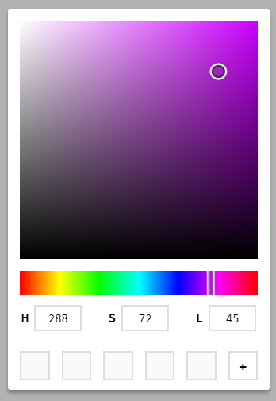
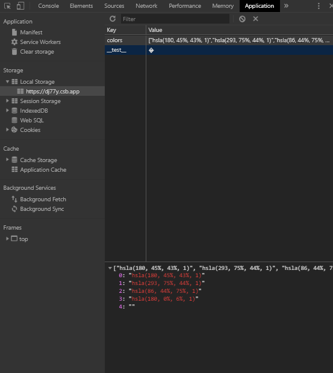

The browser comes equipped with a mechanism called the [Web Storage API](https://developer.mozilla.org/en-US/docs/Web/API/Web_Storage_API) that can be used to store data in key/value pairs. _Session Storage_ persists data for the current session, which ends when the browser tab closes. _Local Storage_, on the other hand, persists data even if the browser is closed and reopened. Both of these storage interfaces can be manipulated with _JavaScript_ and can be used in web applications. To illustrate _Local Storage_ in action this article will walk through the process of adding a saved colors feature to the color picker from [How To Build A Color Picker](). The project is built using [Code Sandbox](https://codesandbox.io/) so don't worry if you haven't read the previous article. I created a new fork of the original sandbox as a jump-off point for this article.

Here is the starting point for this article:

<iframe src="https://codesandbox.io/embed/color-picker-v6oo1?fontsize=14" title="Color Picker" allow="geolocation; microphone; camera; midi; vr; accelerometer; gyroscope; payment; ambient-light-sensor; encrypted-media" style="width:100%; height:500px; border:0; border-radius: 4px; overflow:hidden;" sandbox="allow-modals allow-forms allow-popups allow-scripts allow-same-origin"></iframe>

---

## UI Setup

Most of the new code is going into the _Picker_ component. The first step is to add some new UI elements to display the saved colors. New lines of code will be highlighted.

The `config.js` shares global constants. Add `colorsSize` which is the height of the saved color section.

<div class='filename'>config.js</div>

```js
export default {
  squareSize: 200,
  barSize: 20,
  crossSize: 15,
  inputSize: 40,
  colorsSize: 40, // highlight-line
  delay: 150
}
```

The new UI will appear as five boxes and a plus sign. The new `colors` state variable is initialized as an array of five empty string. The `Array.from` syntax is a little bit of overkill for a five item array but is good to know when creating a larger array is needed. A `length` property and callback function are supplied. For future reference know that the index is passed as the seconds argument to the callback.

With that tangent over, just know that the idea is to add the current color when the plus is clicked. Clicking the color will move the _Handle_ and _Cross_ components to match the values of the saved color. As a bonus, the color will be copied to the clipboard. There should also be a method to delete a color.

<div class='filename'>Picker.js</div>

```jsx
import React, { useState, useRef, useEffect } from 'react'
import styled from 'styled-components'
import Modal from './Modal'
import Hue from './Hue'
import Square from './Square'
import Input from './Input'
import config from './config'

const { squareSize, barSize, crossSize, inputSize, colorsSize } = config // highlight-line

export const PickerWrapper = styled.div`
  user-select: none;
  .swatch {
    width: 100px;
    height: 50px;
    background: ${p => p.color};
  }
`

export const PickerOuter = styled.div`
  width: ${squareSize + 20}px;
  display: grid;
  border-radius: 2px;
  background: #ffffff;
  box-shadow: 0 3px 3px rgba(0, 0, 0, 0.3);
`

export const PickerInner = styled.div`
  display: grid;
  grid-template-rows: ${squareSize + 20}px ${barSize}px ${inputSize}px ${colorsSize}px;
  align-items: center;
  justify-items: center;
`

export const Inputs = styled.div`
  width: 100%;
  display: grid;
  grid-template-columns: repeat(3, 1fr);
  align-items: center;
  justify-items: center;
`
// highlight-start
export const Colors = styled.div`
  width: 100%;
  height: 25px;
  display: grid;
  grid-template-columns: repeat(5, 35px) 1fr;
  align-items: center;
  justify-items: flex-end;
`

export const Color = styled.div`
  width: 25px;
  height: 25px;
  background: ${p => p.color || '#fafafa'};
  border: 1px solid #ddd;
`

export const AddColor = styled.div`
  justify-self: center;
  width: 25px;
  height: 25px;
  display: grid;
  align-items: center;
  justify-items: center;
  font-size: 20px;
`
// highlight-end

function computeHueX(h) {
  return Math.round((squareSize / 360) * h - barSize / 2)
}

function computeSquareXY(s, l) {
  const t = (s * (l < 50 ? l : 100 - l)) / 100
  const s1 = Math.round((200 * t) / (l + t)) | 0
  const b1 = Math.round(t + l)
  const x = (squareSize / 100) * s1 - crossSize / 2
  const y = squareSize - (squareSize / 100) * b1 - crossSize / 2
  return [x, y]
}

const Picker = () => {
  const [show, setShow] = useState(true)
  const [hue, setHue] = useState(180)
  const [hueX, setHueX] = useState(() => squareSize / 2 - barSize / 2)
  const [square, setSquare] = useState([100, 50])
  const [squareXY, setSquareXY] = useState(() => [squareSize - crossSize / 2, crossSize / -2])
  const [offsetTop, setOffsetTop] = useState(0)
  const [offsetLeft, setOffsetLeft] = useState(0)
  const [color, setColor] = useState(`hsla(180, 100%, 50%, 1)`)
  const [animate, setAnimate] = useState(false)
  const [colors, setColors] = useState(() => Array.from({ length: 5 }, () => '')) // highlight-line

  const modal = useRef(null)

  // TODO
  // add localStorage logic

  useEffect(() => {
    function setOffsets() {
      setOffsetTop(modal.current.offsetTop)
      setOffsetLeft(modal.current.offsetLeft)
    }
    if (show) {
      setOffsets()
      window.addEventListener('resize', setOffsets)
    } else {
      window.removeEventListener('resize', setOffsets)
    }

    return () => {
      window.removeEventListener('resize', setOffsets)
    }
  }, [show])

  useEffect(() => {
    setColor(`hsla(${hue}, ${square[0]}%, ${square[1]}%, 1)`)
  }, [hue, square])

  function onHueChange(n) {
    setAnimate(true)
    setHue(n)
    setHueX(computeHueX(n))
  }

  function onSaturationChange(n) {
    setAnimate(true)
    setSquare([n, square[1]])
    setSquareXY(computeSquareXY(n, square[1]))
  }

  function onLightnessChange(n) {
    setAnimate(true)
    setSquare([square[0], n])
    setSquareXY(computeSquareXY(square[0], n))
  }

  // TODO
  // add saved color functions

  return (
    <>
      <PickerWrapper color={color}>
        <div className='swatch' onClick={() => setShow(true)} />
        <Modal modal={modal} show={show} onClose={() => setShow(false)}>
          <PickerOuter>
            <PickerInner>
              <Square
                hue={hue}
                squareXY={squareXY}
                offsetTop={offsetTop}
                offsetLeft={offsetLeft}
                animate={animate}
                setSquare={setSquare}
                setSquareXY={setSquareXY}
                setAnimate={setAnimate}
              />
              <Hue
                hueX={hueX}
                offsetLeft={offsetLeft}
                animate={animate}
                setHueX={setHueX}
                setHue={setHue}
                setAnimate={setAnimate}
              />
              <Inputs>
                <Input
                  label='H'
                  value={hue}
                  min={0}
                  max={360}
                  defaultValue={180}
                  setValue={onHueChange}
                />
                <Input
                  label='S'
                  value={square[0]}
                  min={0}
                  max={100}
                  defaultValue={100}
                  setValue={onSaturationChange}
                />
                <Input
                  label='L'
                  value={square[1]}
                  min={0}
                  max={100}
                  defaultValue={50}
                  setValue={onLightnessChange}
                />
              </Inputs>
              {/*highlight-start*/}
              <Colors>
                {colors.map((c, i) => (
                  <Color
                    key={i}
                    color={c}
                    onClick={() => onColorClick(c)}
                    onContextMenu={e => removeColor(e, i)}
                  />
                ))}
                <AddColor onClick={addColor}>+</AddColor>
              </Colors>
              {/*highlight-end*/}
            </PickerInner>
          </PickerOuter>
        </Modal>
      </PickerWrapper>
    </>
  )
}

export default Picker
```

The update UI should look like this.



---

## Functionality

### Add Color

Find the `// TODO` comment just above the `return` statement. This is where we will insert functions to manipulate our saved colors. The logical first step is to create a function that adds a new color. The _Picker_ already has a hook that updates the current `color` state variable any time the _Hue_, _Saturation_ or _Lightness_ changes. To add a color the function needs to find the first open index in the colors array. This is done by passing a callback to `Array.findIndex` that returns the first index found with a _falsey_ value. In other words, the first empty string. If the colors array is full of valid colors `-1` is returned. Once the index is found we make a copy of `colors` so state isn't mutated. All that is left to do is assign the value at index to `color` and call `setColors`.

```js
function addColor() {
  let index = colors.findIndex(c => !c)
  if (index !== -1) {
    let newColors = colors.slice()
    newColors[index] = color
    setColors(newColors)
  }
}
```

---

### Remove Color

To remove a color the right click event can be used. Its probably a good idea to confirm this action with the user before permanently removing the color. This can be done by assigning a value to `window.confirm`. Also calling `e.preventDefault()` stops the normal context menu from popping up. If the user confirms removal the `colors` array is copied once again. The `Array.splice` method replaces the current color with an empty string. In this case, the event as well as the index from the `Array.map` function are both passed as arguments.

```js
function removeColor(e, i) {
  e.preventDefault()
  let shouldRemove = window.confirm('Delete color?')
  if (shouldRemove) {
    let newColors = colors.slice()
    newColors.splice(i, 1, '')
    setColors(newColors)
  }
}
```

---

### Click Color

When a color is clicked the _Picker_ will shift to the correct values and the _HSL_ colors string will be copied to the clipboard. The function takes a `color` as a parameter and only executes its logic if the `color` is truthy. In other words, if the color square clicked has a value of `""` nothing happens. This first step is to parse the string being passed into it's individual values. `parseHSL` should be added to `utils.js` and imported into `Picker.js`.

```js
function onColorClick(c) {
  if (c) {
    let [h, s, l] = parseHSL(c)
    onHueChange(h)
    setSquare([s, l])
    setSquareXY(computeSquareXY(s, l))
    copyToClipboard(c)
  }
}
```

This utility function uses a [Regular Expression]() with `Array.replace` to effectively remove any character that is not a digit or a comma. The remaining string is then split into an array and then mapped to numbers. To visualize the process image: `"hsla(h, s%, l%, a)" -> [h, s, l, a]`.

```js
export const parseHSL = color =>
  color
    .replace(/[^\d,]/g, '')
    .split(',')
    .map(Number)
```

Existing functions can now be used to set the various positions and values required by _Picker_. Finally, another utilty function copies the color string to the clipboard. This should also be added to `utils.js` and imported into `Picker.js`.

```js
export const copyToClipboard = input => {
  const el = document.createElement('textarea')
  el.value = input
  el.setAttribute('readonly', '')
  el.style.contain = 'strict'
  el.style.position = 'absolute'
  el.style.left = '-9999px'
  el.style.fontSize = '12pt'

  const selection = document.getSelection()
  let originalRange = false
  if (selection.rangeCount > 0) {
    originalRange = selection.getRangeAt(0)
  }

  document.body.appendChild(el)
  el.select()
  el.selectionStart = 0
  el.selectionEnd = input.length

  let success = false
  try {
    success = document.execCommand('copy')
  } catch (err) {}

  document.body.removeChild(el)

  if (originalRange) {
    selection.removeAllRanges()
    selection.addRange(originalRange)
  }

  return success
}
```

---

## Color Picker in Action

At this point the saved colors addition should be fully functional. Try adding, removing and clicking on saved colors to make sure everything is working as intended. The only catch is that when the page is reloaded (`Ctl/Cmd + R`) the saved colors disappear. Enter _Local Storage_. The following code should be inserted at the first `TODO` so it runs before everything else.

```js
useEffect(() => {
  let defaultColors = Array.from({ length: 5 }, () => '')
  let initalColors = JSON.parse(window.localStorage.getItem('colors')) || defaultColors
  setColors(initalColors)
}, [])

useEffect(() => {
  window.localStorage.setItem('colors', JSON.stringify(colors))
}, [colors])
```

The first hook is only run when the app loads. It declares `defaultColors` which should look familiar. Then `localStorage.getItem` is called with the key `colors`. This asking _Local Storage_ for the value associated with `colors`. Since all data within _Local Storage_ is stored as a string we must wrap the request in `JSON.parse`. The logical OR is triggered when `null` is returned from _Local Storage_. `null` will be returned the first time the app runs and also if the `colors` key in _Local Storage_ is cleared. Passing `[]` to `useEffect` means this hook will only run once. Check the _Application_ tab of Chrome DevTools and then select _Local Storage_ in the left hand column to see the contents. Each web page has its own separate storage area.



The second hook fires any time the value of `colors` changes. In this case `localStorage.setItem` is called with the key as the first argument and the value for that key as the second argument. `JSON.stringify` is used here to ensure the data is stored correctly. The `window` object can be omitted since JavaScript automaticaly tries to find variables in this scope.

---

The finsihed product of this article:

<iframe src="https://codesandbox.io/embed/color-picker-local-storage-dj77y?fontsize=14" title="Color Picker - Local Storage" allow="geolocation; microphone; camera; midi; vr; accelerometer; gyroscope; payment; ambient-light-sensor; encrypted-media" style="width:100%; height:500px; border:0; border-radius: 4px; overflow:hidden;" sandbox="allow-modals allow-forms allow-popups allow-scripts allow-same-origin"></iframe>

## Conclusion

Everything should be working properly now. The following is a checklist of features that the _Picker_ should have.

- colors should persist when page is reloaded
- _Hue_ and _Square_ should animate to the new color when a saved color is left clicked
- the _HSL_ value of a saved color should be copied to the clipboard when left clicked
- a right click should open a _Confirm_ window asking if the user wants to remove color
- canceling _Confirm_ should keep the color
- okaying _Confirm_ should remove the color

Here a couple ideas to expand on this article.

- add a reset button that clears the entire `colors` key
- add more saved color slots that can be rotated though 5 at a time
- come up with a better delete color UI
- add the ability to save multiple 5 color palettes that can then be loaded individually from a drop down
- let the user name these palettes
- add _HEX_ or _RGB_ or _HSL_ formatted color string to the UI
- make these strings one click copy
- add all formats with a way to cycle through them
- add UI that lets the user know something was copied
