[Anne's Handmade](https://anneshandmade.herokuapp.com) is a small business owned by a retiree in her 70s. I built this site to help supplement her income and to gain some experience building ecommerce websites. This was a great opportunity to integrate a wide range of features into a single application. My ultimate goal was to create a simple to use website for both the customer and business owner.


---

## Back End

The application is built on top of an [GraphQL](https://graphql.org/) server powered by [Node](https://nodejs.org/) and backed with a [PostgreSQL](https://www.postgresql.org/) database. _GraphQL_ is a modern alternative to a traditional [REST API](https://restfulapi.net/) and allows the client to query exactly what it needs in one request, from a single endpoint.

### Apollo Server

[Apollo Server](https://apollographql.com/docs/apollo-server/) turns a standard [Express](https://expressjs.com/) server into a _GraphQL_ server. I designed a `schema` using the _GraphQL Query Language_ which acts like a blueprint for all the operations available. All the operations are then implemented in `resolvers`.

- Simplified example of a `schema`

```graphql
type Mutation {
  signin(email: String!, password: String): User
}

type User {
  id: ID!
  name: String!
  email: String!
  password: String!
}
```

- Example of the `signin` resolver

```js
const bcrypt = require('bcryptjs')
const validateInput = require('../utils/validateInput')
const createCookie = require('../utils/createCookie')
const signToken = require('../utils/signToken')

module.exports = async (_, args, ctx, info) => {
  // validate email, password
  validateInput('signin', args)

  // check if there is a user with that email
  const user = await ctx.prisma.user({ email: args.email.toLowerCase() })

  // if no user throw error
  if (!user) throw new Error(`no user for email ${args.email}`)

  // check if password is matches database
  const valid = await bcrypt.compare(args.password, user.password)

  // if no match throw error
  if (!valid) throw new Error('invalid password')

  // create token
  const token = signToken(user.id)

  // create cookie
  createCookie(ctx.res, token)

  // return user
  return user
}
```

---

### Prisma

[Prisma](https://www.prisma.io/) acts as an _ORM_ and allows the application to communicate with the database. _Prisma_ is nice to work with because all the developer has to do is supply a datamodel it creates the entire data layer API. _Prisma_ comes with a handy _CLI_ tool that makes interacting with the database easy from the command line.

---

### Playground

A benefit of _GraphQL_ is the _Playground_ feature. When the backend server is running, a GUI is available at `/graphql` where `Queries` and `Mutations` can be ran against the database. This is great for making sure everything works the way it is intended while in development.

- A simple `Query` displaying a list of all products in the database.

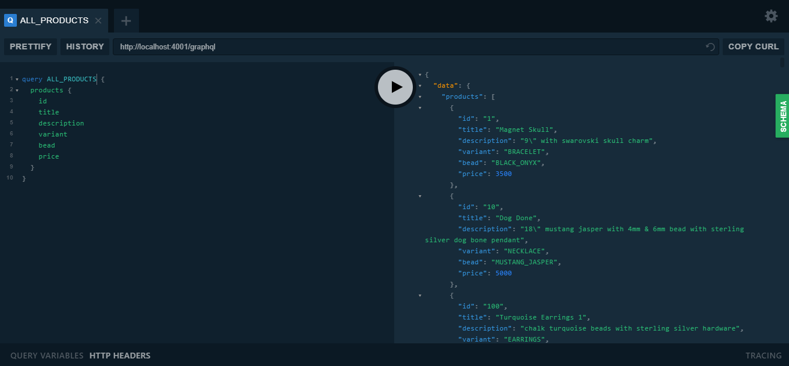

---

### Email

The server has the ability to send email to users when they interact with the site. The most important event is when a user purchases a product. When this occurs the user is sent a _Thank You_ note along with the invoice for their purchase. The email contains some branding, a summary of products purchased and links back to the site.

- _Thank You_ email

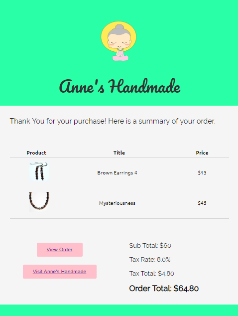

---

### Permissions

The API allows for powerful operations such as creating, updating and deleting products. I built a permission system that protects the application from these operations being performed by bad actors. The `ADMIN` role comes with elevated privledges that allow the user to execute these powerful actions. The default role is `USER`, and people that signup are automatically assigned this role. In fact, the only people that have the `ADMIN` privledges are myself and the business owner.

This system works by checking the user's credentials which are sent inside a cookie with all requests. The cookie contains the user's `ID`, which is used to look them up in the database. The `role` property is then examined to see if it matches the requirements for the operation requested. If the requirement is not met an error is thrown and the operation is denied.

- Permissions can be tested in the _Playground_. This example illustrates attempting to delete a product without the role of `ADMIN`.

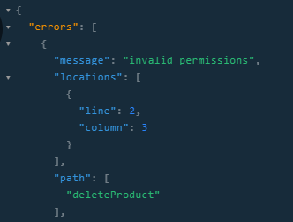

---

### AWS S3

[AWS S3](https://aws.amazon.com/s3/) is used to store product images. Since the `ADMIN` has the ability to create and delete products from the front end user interface I added the ability to upload and delete images from _AWS S3_. This is a nice feature that makes adding new products much more efficient. Without the integration the images would have to be added to _S3_ separately which would be a pain.

---

### Google Sheets

I used [Google Sheets](https://docs.google.com/spreadsheets/), a spreadsheet, as the single source of truth for all of the product data. I was able to integrate the _Google Sheets API_ with my backend via a database seeding script. This was useful in development because I could drop the database and easily re-seed all the products when I made changes.

---

## Front End

The user interface is built with [Nextjs](https://nextjs.org/), a _React_ framework for building server-side rendered applications.

### Images

As a side note, I took all the photos for this site myself. I used the trunk of my white Honda Accord as the backdrop. I went through a tedious process to prepare the images for use on the web. Each image had to be cleaned up and cropped to a square using [Gimp](https://www.gimp.org/). Then I used [JPEG Optimizer](http://jpeg-optimizer.com/) to compress the images. Keeping the images small keeps overhead low by reducing the storage space needed and by shrinking the amount of data transferred. This is also good for performance. I was able to reduce the size of each image from ~400KB to ~30KB.

### Shopping Cart

The _Cart_ is a standard ecommerce feature where a user can place items they intend to purchase. A product can be added to the _Cart_ by clicking the 🛒 icon from the search results page or by clicking the `Add to Cart` button from the product page. The _Cart_ itself can be toggled in and out of view by clicking _Cart_ on the page header. The number of items currently in the cart is always displayed.

- Catalog Page
  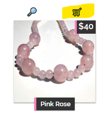

- Product Page
  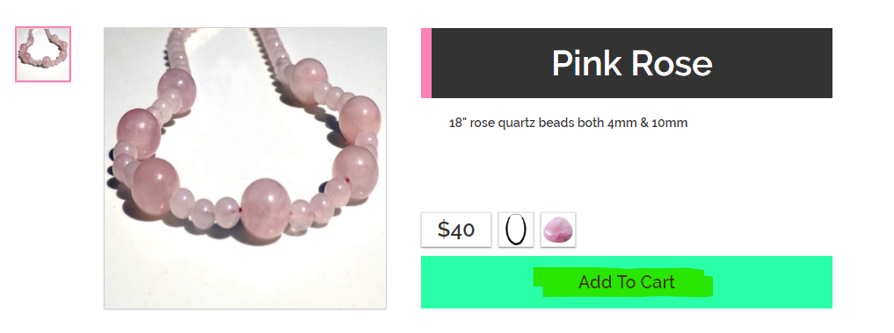

- When the _Cart_ is opened each item is listed as well as a price breakdown including item price, tax, subtotal and total.

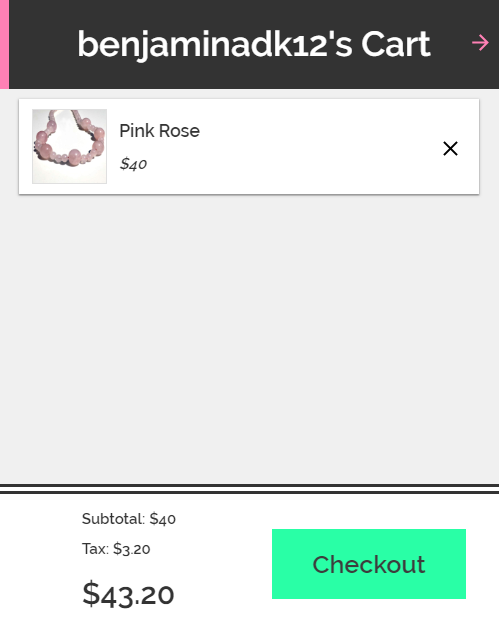

---

### Stripe Checkout

[Stripe Checkout]() provides a simple form that can recieve all the input necessary to complete a sale. When the user submits the form, the data is tokenized and sent to back end which then reaches out to _Stripe_ to approve the sale. Once approved the back end creates a record of the sale including the shipping address of the user and the id of the sale on _Stripe_.

- _Stripe Checkout_ makes the purchase flow smooth and easy for the user.

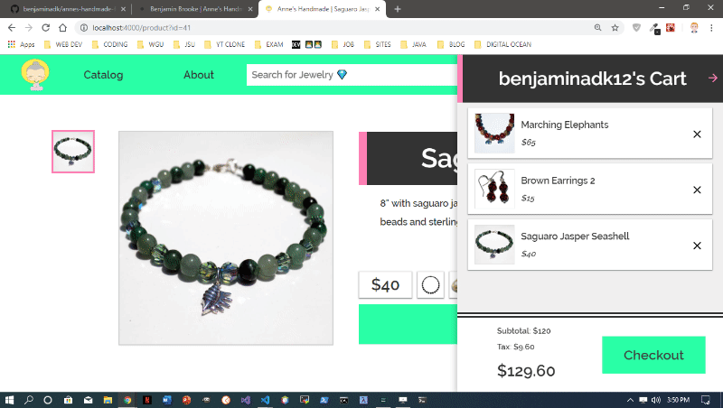

---

### Responsive Design

In today's landscape a website needs to look good on a wide variety of screen sizes from televisions to smart phones. This is accomplished through the use of _Media Queries_. An example of this can be seen in the _Catalog_ component. On a large screen products are displayed in a four column layout, but when the screen is small the layout is changed to one column. Notice the header is also different on smaller screens.

- _Catalog_ on 1360px wide screen.

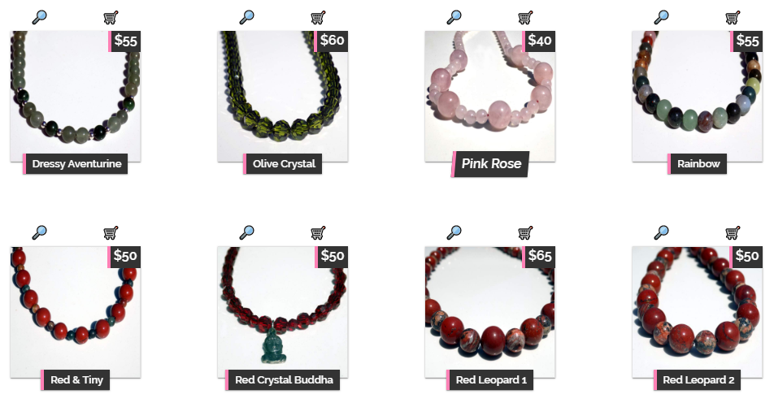

- _Catalog_ on 375px wide screen.

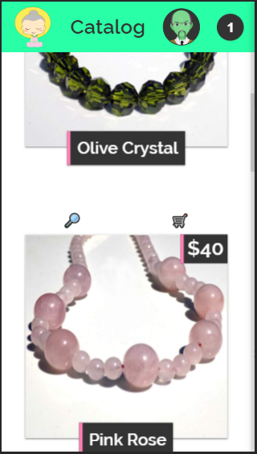

### Apollo Client

[Apollo Client]() acts as the bridge between the user interface and the back end _GraphQL_ server and enables several key features. The products available at _Anne's Handmade_ are classified into three categories - `NECKLACE`, `BRACELET` or `EARRINGS`, as well as several bead types - `RED_JASPER`, `BLACK_ONYX`, etc. When the user is browsing the catalog these parameters are fed to _Apollo Client_ via `query parameters` in the page `URL`. Once _Apollo Client_ has these parameters is queries the database and returns the matching products.

- Catalog displaying products with a bead type of `RED_JASPER`.

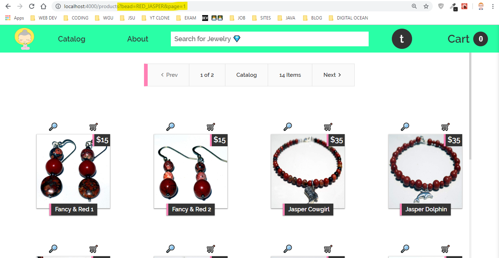

---

### Pagination

Pagination is another feature made possible by _Apollo Client_. This means only a fixed number of results are returned with each request. This prevents requests from becoming too big and lets the user focus on a small number of products at a time. The user can browse pages by clicking `Next` and `Previous`.

---

### Search

The _Search_ feature uses [Downshift](https://github.com/downshift-js/downshift) to give the user a preview of any item matching their search criteria. A drop down is displayed with the name of the product and a small thumbnail image. When an individual item is clicked the user is brought to that product's page.

- Searching for the term `buddha` fetches 6 matches.

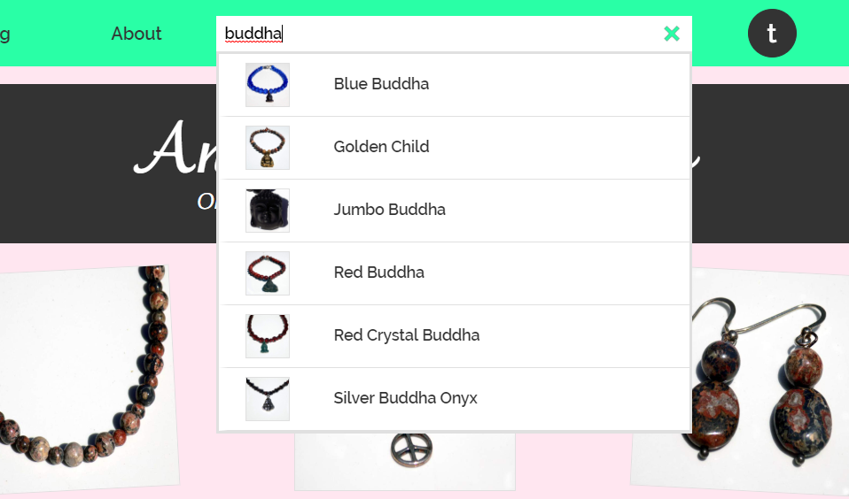

---

### Orders

- A user can easily pull up their entire purchasing history.

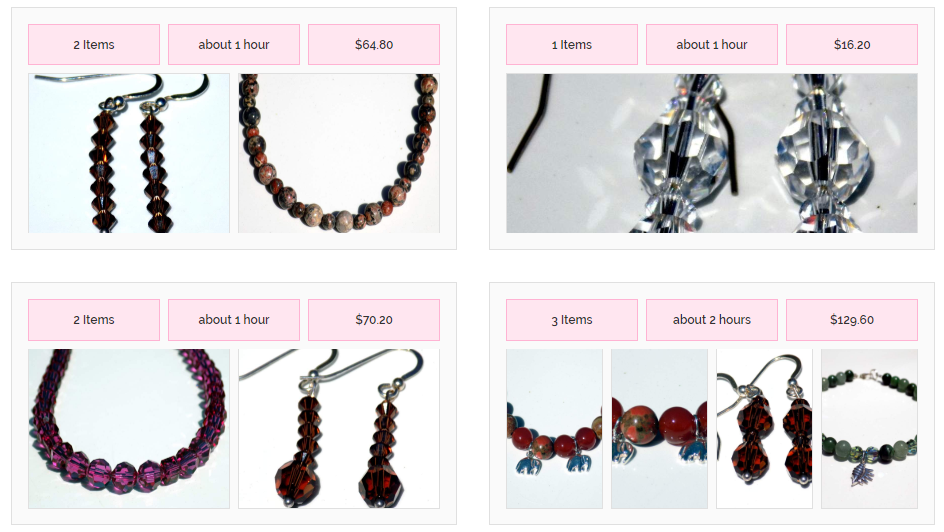

---

### Admin Dashboard

Only users with the `ADMIN` role can access the powerful _Admin Dashboard_. From this interface the `ADMIN` can create, update and delete products, as well as view sales records and inventory. The interface is built with [React Table](https://github.com/tannerlinsley/react-table).

- _React Table_ in action.

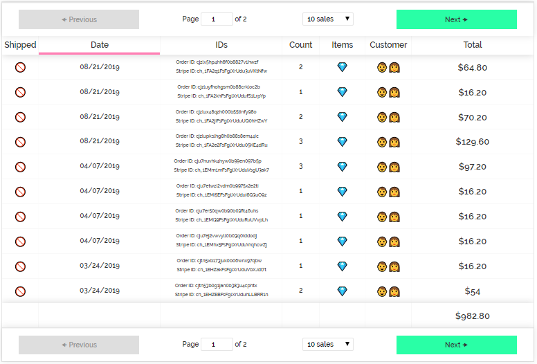

- Viewing a sales record to get the user's shipping address and toggle the shipped status to true. A link is also available to pull up the sales record on _Stripe_.

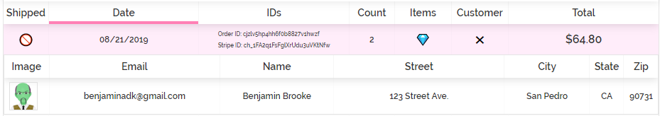

- Viewing an inventory record to update a product property, add/remove an image and raise/lower the price.

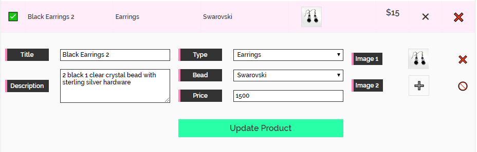

---

### CI Build System

[Travis](https://travis-ci.org/) is used to make sure all tests are passing before new code is sent to production. When new commits are pushed to version control _Travis_ is triggered and the application is built on their servers. If the build succeeds a suite of tests I wrote is run with [Jest](https://jestjs.io/). Only when all of these tests pass are the commits pushed to version control and the new code deployed.

### Deployment

Currently, _Anne's Handmade_ is deployed on the free tier of [Heroku](https://www.heroku.com/). This is not ideal in terms of performance. Using this setup there are three separate servers - one each for the front end, back end and database, all of which go into sleep mode when not being used. This means that there is considerable loading time when the site is visitted for the first time after a period on inactivity. In the future I hope the business owner will let me devote more resources to deployment.
