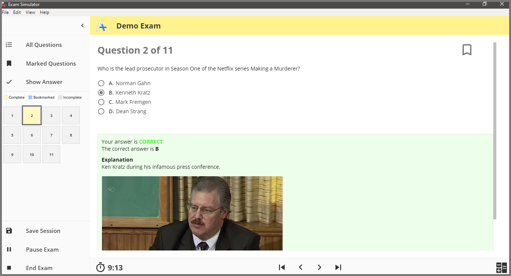

I created the [Exam Simulator](https://github.com/exam-simulator/simulator) prototype as a free alternative to _VCE_ format exam simulators. While my _Exam Simulator_ can be used for any type of test, I saw a huge hole in the technical certification market. There are many sites that charge high fees to download _VCE_ files or to purchase their exam simulators. Companies can do so because _VCE_ files are binary and it seems that much of the code capable of reading them is proprietary. It all makes sense financially. I feel like a free or lower cost alternative using _JSON_ could gain a large share of the market if enough time and resources were invested. If a _JSON_ based system is financially viable is another question.

---

_Exam Simulator_ is a desktop application made with [Electron](https://electronjs.org), [Node](https://nodejs.org/en/) and [React](https://reactjs.org/). It is available for _Windows_ & _MacOS_. It ships with a 10 question demo exam based on the popular series _Making a Murderer_. Questions can be multiple choice, multiple answer, true/false, fill in the blank or drag and drop reorder lists. In addition to exam files, _Exam Simulator_ also stores a reviewable history of all the exams a user has taken. When reviewing a history item the user can add their own personal notes and see how much time they spent on each question.

I also built a prototype web application call [Exam Maker](https://exam-maker.herokuapp.com/) that provides a graphical user interface that can be used to create _JSON_ files which conform to _Exam Simulator's_ schema. While my documentation outlines the exam schema and anyone with a text editor can create an exam manually, I figured the majority of users would not be software developers and would benefit the GUI. I shared a link to this project on my college forum and within a day the entire free-tier _Heroku_ database I used was full. In the future I may continue work on this project. Any developer that is interested in contributing please contact me.
