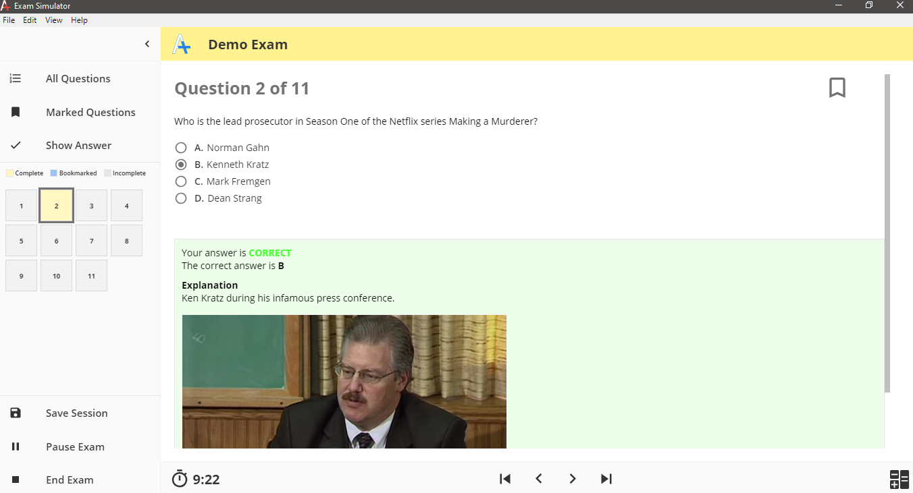

[Source Code](https://github.com/exam-simulator/simulator)

I created the _Exam Simulator_ prototype as a free alternative to _VCE_ format exam simulators. While my _Exam Simulator_ can be used for any type of test, I saw a huge hole in the technical certification market. There are many sites that charge high fees to download _VCE_ files or to purchase their exam simulators. Companies can do so because _VCE_ files are binary and it seems that much of the code capable of reading them is proprietary. It all makes sense financially. I feel like a free or lower cost alternative using _JSON_ could gain a large share of the market if enough time and resources were invested. If a _JSON_ based system is financially viable is another question.

The code is open source, so anyone can fork my repository and build on the work I have done. In addition to that, the compiled executables are also available for free on GitHub. Currently, I am offering Windows and MacOS versions.

The _Exam Simulator_ is a fairly simple [Electron](https://www.electronjs.org/) desktop application. Instead of loading a _VCE_ file, my simulator uses a human readable JSON file. [Basic Documentation](https://exam-simulator.gitbook.io/exam-simulator/) will help get anyone started to using this software. Using the software is intuitive. Questions can be multiple choice, multiple answer, fill-in or list order. Other features include advanced exam navigation, bookmarks, saved exam sessions, saved history, exam analysis and much more.

In the future I plan on refining this project and creating a mobile version.
