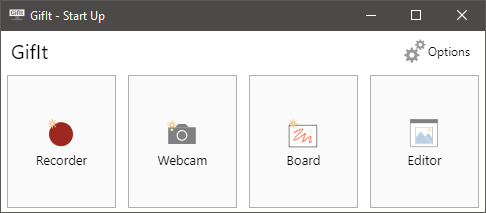
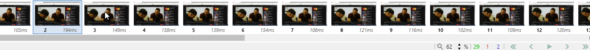
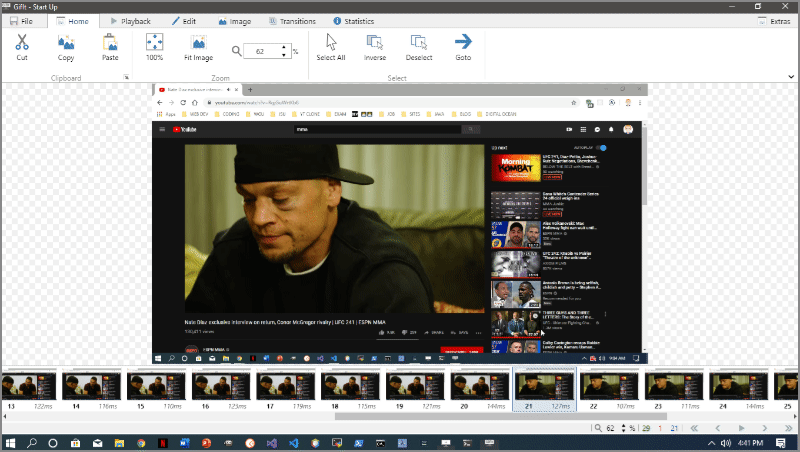
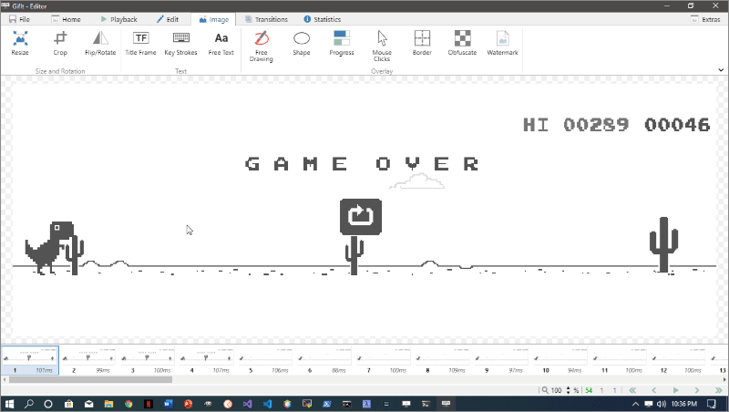
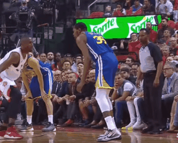

[Source](https://github.com/benjaminadk/gifit)

_GifIt_ is a desktop application that allows users to record _GIFs_ from their desktop, webcam or a built in white board. This application is built with [Electron](https://electronjs.org/), [React](https://reactjs.org/) and [Node](https://nodejs.org/en/) and is available for Windows (there is a MacOS version compiled in the repository but I haven't been able to test it yet.) My aim for this project was to reverse engineer [ScreenToGif](https://www.screentogif.com/), a popular application built with _.NET_ and written in _C#_. I was able to build features by playing around with the original version and through a lot of trial and error. This project is not meant for distribution, but is a showcase of my problem solving skills and general _JavaScript_ ability.

<div class='center'>

</div>

---

## Recording

_GifIt_ ships with three separate recorders, the _Desktop_, _Webcam_ and _White Board_ recorders are accessed through the _Start Up_ window.



---

### Desktop Recorder

The _Desktop Recorder_ captures a series of images that can later be editted an encoded into a _GIF_. Possible use cases of this feature are to display the use an interactive component, record an animation or to demonstrate a step by step tutorial. Recently, I designed my own version of the classic game [Minesweeper](/visualizations/minesweeper). The _Desktop Recorder_ allows me to select the specific region of the screen I want to record so I can show off my skills as both a developer and as a sweeper of mines.

<div class='center'>

</div>

Images are captured by using `setInterval` to repeatedly fire a function at a user set framerate. The _Electron_ `desktopCapturer` exposes a video stream which is sent through an _HTML_ video element and drawn to a _Canvas_ element. The _Canvas_ API has a `toDataURL` method which is used to get the image data on each iteration of the interval. A reference to the `setInterval` is stored in a _React_ `ref` so the recording process can be paused and resumed. The image data is stored in an [Immutable]() list until the recording process is stopped. As each frame is captured the recorder also keeps track of the elapsed time and can listen for mouse and keyboard events. Each frame of the image data is saved as a _PNG_ file in a new project directory. A _JSON_ file containing important data such as the width, height and date of the recording as well as the filename, duration and user input data from each frame is also saved to the project directory. When the recording stops the _JSON_ and _PNG_ files are wrote to disk using standard _Node_ APIs.

---

## Editor

The _Editor_ has a multitude of features. This is where the image files collected by the various recorders can be editted, deleted or encoded into a _GIF_. When a recording ends the _Editor_ automatically opens a new project. The layout is intuitive with a row of thumbnails acting as navigation at the bottom of the page. The main portion of the screen is where the current image is displayed. The top of the _Editor_ uses a ribbon style menu with multiple tabs each containing multiple commands. Most of these commands require some degree of user input and interaction which takes place in an animated drawer that slides in and out from the right hand side of the screen. Other basic features include playback controls and zoom.

<div class='center'>

</div>

---

### Selection

Many of the _Editor_ features involve manipulating one or more image. Multiple images can be selected at a time by using the standard `Ctl/Cmd` and `Shift` key modifiers. Holding `Ctl/Cmd` while clicking a thumbnail adds that thumbnail to the current selection. Holding the `Shift` key adds all thumbnail from the nearest selection through the current selection. `Ctl/Cmd + A` selects all thumbnails and `Ctl/Cmd + Delete` will delete selected thumbnails.

<div class='center'>

</div>

---

### Zoom

The foundation of the _Editor_ is _HTML Canvas_. The main section is actually comprised on 5 _Canvas_ elements layered on top of each other. When the _Editor_ loads a new project the _JSON_ configuration file is read from every project directory is read into memory. Any project can now be opened via the _Recent Projects_ menu. The _Recorder_ saves the name of the directory it just created as state so when the _Editor_ comes across that _JSON_ file it uses it compute various settings. The `width` and `height` of the images are used to determine the dimensions of the thumbnails and the inital zoom level of the _Canvas_ `context`. The absolute paths to all the images are stored as an array in state and accessing each one is accomplished by matching the index of selected thumbnail to the array. The first or bottom _Canvas_ is the where the actual image is drawn.

The snippet of code in charge of drawing the main image in the _Editor_.

```js
useEffect(() => {
  if (imageIndex !== null) {
    // set the scale or zoom
    ctx1.scale(scale, scale)

    // create a new image
    const image = new Image()

    // when image loads draw to ctx1
    image.onload = () => {
      ctx1.drawImage(image, 0, 0)
    }

    // add hashModifier to trick cache on image changes
    // needed because filename remains the same but imagedata is overwritten
    image.src = images[imageIndex].path + hashModifier
  }

  // dependencies
}, [images, imageIndex, scale, hashModifier])
```

The scale, zoom level can easily be changed through various parts of the user interface. A _React Hook_ is used to watch for changes in the `scale` value and the `imageIndex`. Whenever a change is detected the image is redrawn. A `hashModifier` (I used the current timestamp) is added to the end of the image url to trick the browser cache. Whenever images are altered without the page reloading the browser tries to conserve requests via caching. Without this trick many images show up empty or not updated without a page reload. This `useEffect` hook is re-run any time one of its dependencies change.

<div class='center'>

</div>

---

### Playback

Playback is useful to get an idea of how the eventual _GIF_ will look as it plays. The duration of each frame is recorded and saved in the project's _JSON_ file making this approximation of a _GIF_ in the _Editor_ is possible. Duration is a number in milliseconds and is based on the initial framerate set by the user. The playback controls are presented in the bottom right corner of the screen and in the main menu. The available commands include play/pause, previous/next frame and first/last frame. A `Boolean` value representing whether the project is playing is kept in the _Editor_ state. Another `useEffect` hook is triggered any time the `playing` or `imageIndex` state is changed. Remember, the `imageIndex` controls which image is displayed in the _Editor_, so increasing this by one shows the next image. The hook is built around `setTimeout` and if the `playing` variable is true the `imageIndex` state is increased by one using the duration of the current frame as the delay. When the `setTimeout` executes the hook is triggered again and the previous timeout is cleared. Each iteration checks to see if the `imageIndex` is the last one in the array, and if it is the value is reset to 0. This creates the looping effect.

```js
useEffect(() => {
  // keep track of setTimeout
  var pid
  // user clicked play button
  if (playing) {
    pid = setTimeout(() => {
      setImageIndex(x => (x === images.length - 1 ? 0 : x + 1))
    }, images[imageIndex].time)

    // user clicked pause button
  } else {
    if (pid) {
      clearTimeout(pid)
      setSelected(selected.map((el, i) => i === imageIndex))
    }
  }
  return () => clearTimeout(pid)
}, [playing, imageIndex])
```

The image below is a _GIF_ of the _Playback_ features in action. When the play button is pressed the _Editor_ cycles through the frames. Notice that duration and index of each frame is displayed below each thumbnail. When the `imageIndex` changes the corresponding thumbnail is scrolled into view and highlighted. As a side note, this game is built into _Google Chrome_ and appears when there is no internet connection. To access the game anytime type `chrome://dino` into the search box.

<div class='center'>

</div>
---

### GIF Encoding

The ability to encode _GIFs_ is a crucial feature of the application. Encoding is the process of writing a file that conforms to the [GIF Specification](https://www.w3.org/Graphics/GIF/spec-gif89a.txt) based on the images and durations captured by the various recorders. _GifIt_ takes two separate approaches to encoding _GIFs_. The default approach uses a library I wrote called [Gif Encoder 2](https://github.com/benjaminadk/gif-encoder-2). I built upon the existing _JavaScript_ _GIF_ encoding libraries by adding optimizations and the ability to use an additional algorithm. As a _GIF_ is encoded each image is analyzed and reduced to a palette of at most 256 colors. Each pixel in the original image is then mapped to a color from this palette. There is also a compression process that takes place to reduce the file size. My encoder adds the ability to reuse color palettes when consecutive images are similar. This can reduce overall process time. I also added the [Octree Algorithm](https://en.wikipedia.org/wiki/Octree) which takes a little more time on average, but also reduces the output file size.

<div class='center'>

</div>

Example from the _Gif Encoder 2_ documentation creating a _GIF_ from a directory of image files. This is essentially what takes place in the application.

```js
const { createCanvas, Image } = require('canvas')
const { createWriteStream, readdir } = require('fs')
const { promisify } = require('util')
const path = require('path')
const GIFEncoder = require('..')

const readdirAsync = promisify(readdir)
const imagesFolder = path.join(__dirname, 'input')

async function createGif(algorithm) {
  return new Promise(async resolve1 => {
    // read image directory
    const files = await readdirAsync(imagesFolder)

    // find the width and height of the image
    const [width, height] = await new Promise(resolve2 => {
      const image = new Image()
      image.onload = () => resolve2([image.width, image.height])
      image.src = path.join(imagesFolder, files[0])
    })

    // base GIF filepath on which algorithm is being used
    const dstPath = path.join(__dirname, 'output', `intermediate-${algorithm}.gif`)
    // create a write stream for GIF data
    const writeStream = createWriteStream(dstPath)
    // when stream closes GIF is created so resolve promise
    writeStream.on('close', () => {
      resolve1()
    })

    const encoder = new GIFEncoder(width, height, algorithm)
    // pipe encoder's read stream to our write stream
    encoder.createReadStream().pipe(writeStream)
    encoder.start()
    encoder.setDelay(200)

    const canvas = createCanvas(width, height)
    const ctx = canvas.getContext('2d')

    // draw an image for each file and add frame to encoder
    for (const file of files) {
      await new Promise(resolve3 => {
        const image = new Image()
        image.onload = () => {
          ctx.drawImage(image, 0, 0)
          encoder.addFrame(ctx)
          resolve3()
        }
        image.src = path.join(imagesFolder, file)
      })
    }
  })
}

createGif('neuquant')
```

The second approach to encoding involves using [FFmpeg](https://ffmpeg.org/), a cross platform audio/video library. _FFmpeg_ must be installed on the user's machine for this to work. The application will check to see if the executable is in the `PATH` variable when it loads. The user can also manually enter the path in options. _Node_ has the ability to run _FFmpeg_ as a child process and the resulting _GIFs_ are produced much faster and at smaller sizes than when using the _JavaScript_ implementation. Getting this method to work was a little tricky and I wouldn't call _FFmpeg_ beginner friendly.
