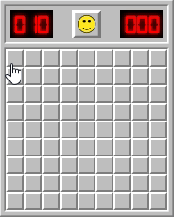
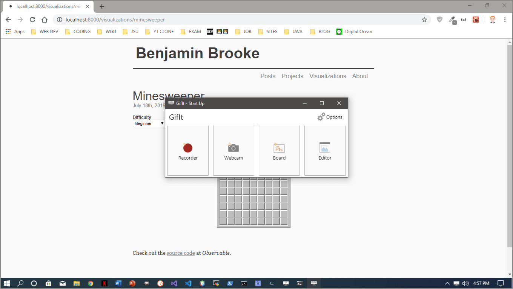
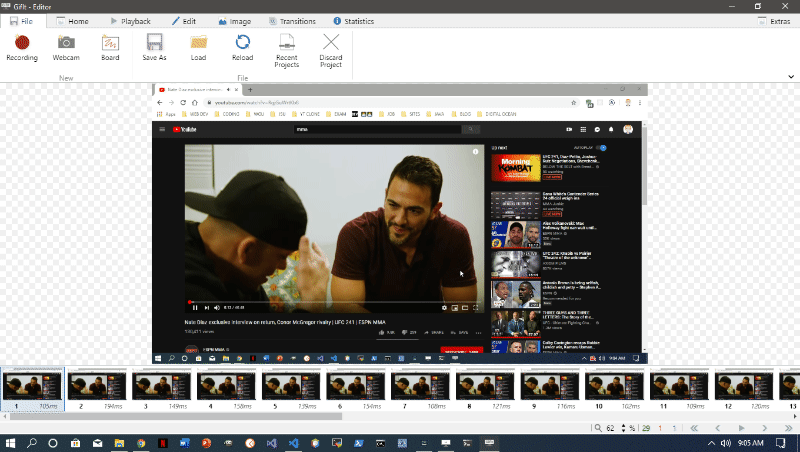

[GifIt](https://github.com/benjaminadk/gifit) is a desktop application that allows users to record _GIFs_ from their desktop, webcam or a built in white board. This application is built with [Electron](https://electronjs.org/), [React](https://reactjs.org/) and [Node](https://nodejs.org/en/) and is available Windows. My goal was to reverse engineer [ScreenToGif](https://www.screentogif.com/), a popular application built with _.NET_ and written in _C#_. I was able to build features by playing around with the original version and through a lot of trial and error. This project is not meant for distribution, but is a showcase of my problem solving skills and general _JavaScript_ ability.

# Desktop Recorder

The _Desktop Recorder_ captures a series of images that can later be editted an encoded into a _GIF_. A possible use case of this feature is to record an interactive component or an animation. Recently, I designed my own version of the classic game [Minesweeper](/visualizations/minesweeper). The _Desktop Recorder_ allows me to select the specific region of the screen I want to record so I can show off my skills as both a developer and as a sweeper of mines.

Images are captured by using `setInterval` to fire a function at a user set framerate. The _Electron_ `desktopCapturer` exposes a video stream which is sent through an _HTML_ video element and drawn to a _Canvas_ element. The _Canvas_ API has a `toDataURL` method which is used to get the image on each iteration of the interval. A reference to the `setInterval` is stored in a _React_ `ref` so the process can be paused and resumed. The image data is stored in an [Immutable]() list until the recording process is stopped. As each frame is captured the recorder also keeps track of the elapsed time and can listen for mouse and key events. Each frame of the image data is saved as a _PNG_ file in a project directory. A _JSON_ file containing important data such as the width, height and date of the recording as well as the filename, duration and input data from each frame is also saved to the project directory.

# Editor

The _Editor_ has a multitude of features. This is where the image files collected by the various recorders can be editted, deleted or encoded into a _GIF_. When a recording ends the _Editor_ automatically opens with a new project. The layout is intuitive with a row of thumbnails acting as navigation at the bottom of the page. The main portion of the screen is where the current image is displayed. The top of the _Editor_ uses a ribbon style menu with multiple tabs each containing multiple commands. Most of these commands require some degree of user input and interaction which takes place in an animated drawer that slides in and out from the right hand side of the screen. Other basic features include playback controls and zoom.

