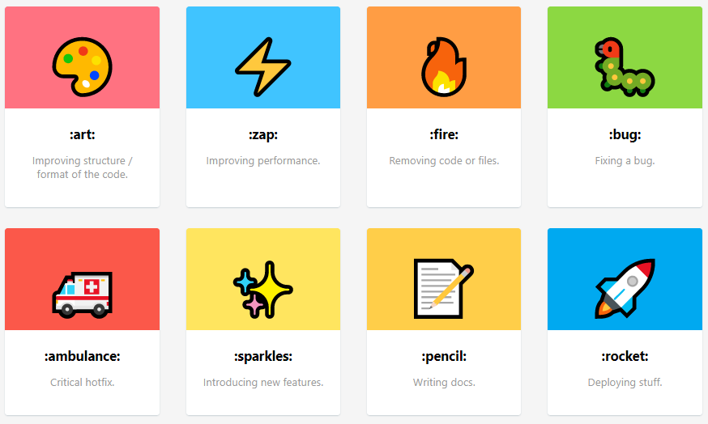
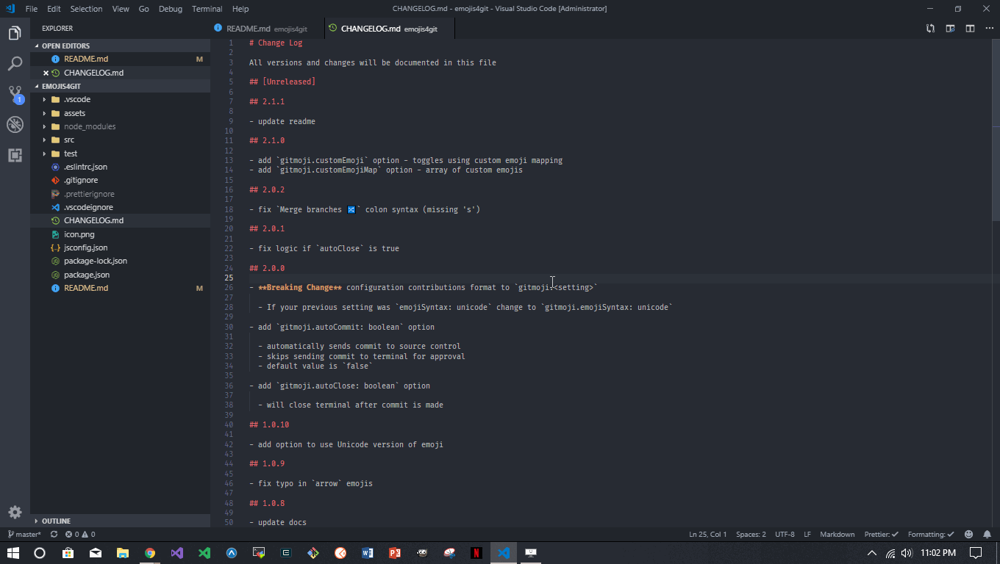

[Gitmoji Commit](https://marketplace.visualstudio.com/items?itemName=benjaminadk.emojis4git) is an extension for [Visual Studio Code](https://code.visualstudio.com) that allows users to easily compose _Git_ `commit` messages with emojis. The default emoji mapping is based on [Gitmoji](https://gitmoji.carloscuesta.me/) where each emoji is associated with a certain type of commit. The purpose of the system as a whole is to make commit messages easy to identify by only looking at the emoji and not have to read the text in every message. A user can also supply their own emoji system via the settings in _VS Code_.

The genesis of _Gitmoji Commit_ came about when I was working in a small team and the team leader wanted to use emojis in our commit messages. This didn't seem like a hassle until I found myself having to surf around and lookup the right emoji every time I made a commit. I searched for an extension in _VS Code_ and when I came back with nothing I decided it would be a good time to learn how to write my own. _VS Code_ has done a great job documenting the steps required to [work with extensions](https://code.visualstudio.com/api/get-started/your-first-extension).

## Commit Message

Once the extension is installed it is easy to integrate into a normal workflow. When the time comes to make a commit open _Gitmoji Commit_ through a keyboard shortcut or through the _Command Palette_. Since the keyboard shortcut needs to be setup manually lets walk through the _Command Palette_ flow.

1. Open the _Command Palettes_ with `Cmd/Ctl + Shift + P`
2. Search for `Gitmoji Commit: Commit Message` and click on it
3. A searchable list of emojis will appear which includes a description of the commit type - `Inital Commit`, the colon syntax - `:tada:`, and, of course, the emoji itself - `🎉`
4. Either scroll the list or type words associated with the commit type to narrow down the list
5. Select an emoji
6. A new text field will appear which accepts the actual text of the commit message
7. Type the commit text and press `Enter`
8. The entire commit message will appear in the terminal - `git commit -m ':tada: Initial Commit'`
9. The extension can be configured to automatically execute the command or to require one additional `Enter` keypress

Check out the [Gitmoji Commit README](https://github.com/benjaminadk/emojigit) to learn about all the features.
