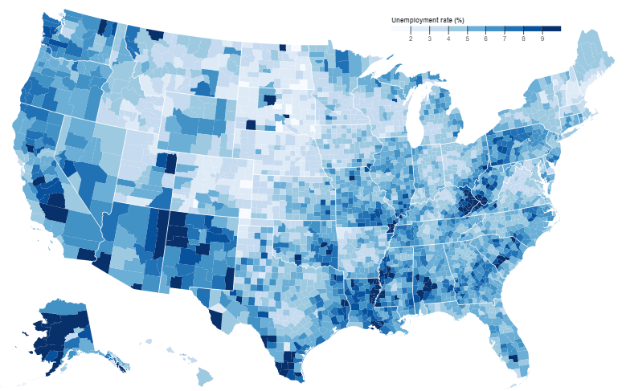
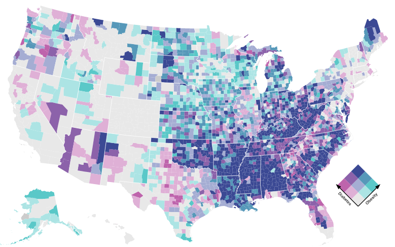
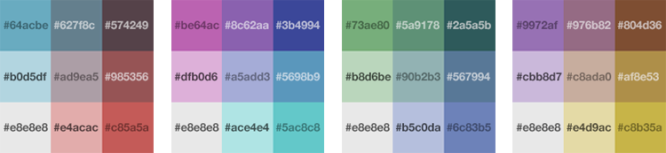

To understand the purpose of this tool it is important to understand what a _Bivariate Choropleth Map_ is. Lets break it down. _Bivariate_ simply means two variables. _Choropleth_ translates from the greek _choro_ (area) + _plethos_ (multitude). A standard _Choropleth_ map with one variable might look at the unemployment rate in every county in the United States and color each county based the rate for that county. In the map below, counties with higher unemployment rates are shaded darker than those with lower rates. This creates an easy to understand visualization of the data.

Source: [@d3/choropleth](https://observablehq.com/@d3/choropleth)

Creating a color scale for a _Univariate Choropleth_ is straightforward, featuring shades of the same base color. This process becomes more complicated when we want to show the relationship between two variables in a _Bivariate Choropleth_. The map below is a _Bivariate Choropleth_ that shows the relationship between Diabetes and Obsetity rates on the county level.

Source: [@d3/bivariate-choropleth](https://observablehq.com/@d3/bivariate-choropleth)

It takes a little more time to understand what the various colors mean, but that is because there is more information being conveyed by the map. A good _Bivariate Choropleth_ not only shows data, it shows a _relationship_ between two data sources. I think the above map is compelling in that most counties with high obesity also have high diabetes and that most of these counties are concentrated in the same geographical area. The color scheme helps to convey this message and also makes the map nice to look at. The pink color (diabetes) and teal color (obesity) pair well side by side, but also blend together well into a darker blue/purple. Creating a color scheme that looks good and is well balanced can be a challenge.

There are a few established color schemes floating around the web, but what if you want your own unique look? Making one of these color schemes by trial and error will drive anybody crazy. Enter this tool. It takes care of all the color blending for you and hopefully offers enough options to fit your needs.

For further reading on this topic check out [Joshua Steven's Article](http://www.joshuastevens.net/cartography/make-a-bivariate-choropleth-map/) that really does a great job.
