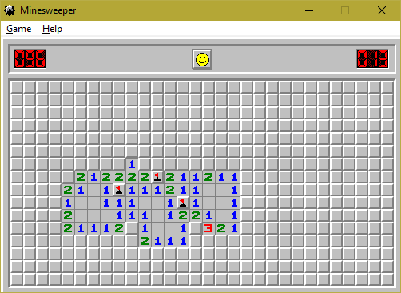

Check out the [source code](https://observablehq.com/@benjaminadk/minesweeper) at _Observable_.

Back in the day, cerca 1995, my family bought our first computer. Back then any _Windows_ machine was guaranteed to have two, and only two, games. _Solitare_ and _Minesweeper_ are both classics. Recently, a job interview suggested I create a command line version of the latter, but I decided I was more interested in recreating the classic look of _Minesweeper's_ graphics. I used [D3](https://d3js.org/) and some homemade _SVG_ patterns to bring it to life. The outline around the game and the fonts are the only elements I didn't create using [BoxySVG](https://boxy-svg.com/), although piecing together the images that make up that outline was perhaps the crux of the whole project.

The original _Minesweeper_:

